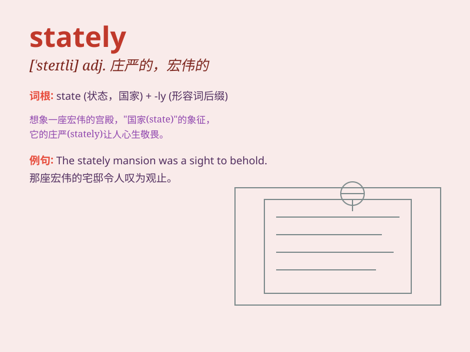

## stately

**英音:** _[\'steɪtlɪ]_ **美音:** _[\'stetli]_

**译义:** *adj.庄严的,堂皇的*

### 短语

+ **stately home:** _宏伟的宅第_

+ **stately manner:** _庄重的举止_

+ **stately progress:** _庄严的行进_

+ **stately building:** _宏伟的建筑_

+ **stately dance:** _庄重的舞蹈_

### 例句

#### 例句1

> **The stately mansion stood at the end of the long driveway.**

**中文翻译:** 那座宏伟的宅邸矗立在长长的车道尽头。

**单词释义:** 宏伟的；庄严的（形容宅邸的外观给人留下的印象）

#### 例句2

> **She walked with a stately gait.**

**中文翻译:** 她迈着庄重的步伐走着。

**单词释义:** 庄重的（描述走路的姿态）

#### 例句3

> **The stately oak tree dominated the landscape.**

**中文翻译:** 那棵雄伟的橡树在景色中占主导地位。

**单词释义:** 雄伟的（强调橡树的高大和令人瞩目的特质）

### 背诵小故事

> A king was walking in his stately garden. The tall trees and
beautiful flowers made the garden look magnificent. The king moved with
grace and dignity, just like the meaning of \'stately\' which means
grand and impressive.

**一位国王在他宏伟的花园中散步。高大的树木和美丽的花朵使花园看起来壮丽非凡。国王优雅而有尊严地走着，这就像'stately'这个词的意思，即宏伟的、庄严的。**

### 图义

