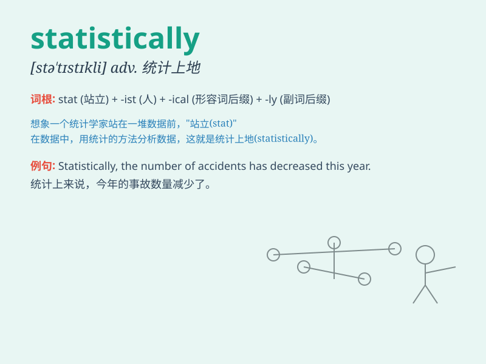

## statistically

**英音:** _[stə\'tɪstɪkli]_ **美音:** _[stə\'tɪstɪkli]_

**译义:** *adv.统计上地,统计地*

### 短语

+ **statistically significant:** _有统计学意义的；统计上显著的_

+ **statistically independent:** _统计独立的_

+ **statistically valid:** _统计有效的_

+ **statistically analyzed:** _进行统计分析_

+ **statistically based:** _基于统计的_

### 例句

#### 例句1

> **Statistically, men are more likely to be involved in car
accidents than women.**

**中文翻译:** 从统计学角度来看，男性比女性更有可能卷入车祸。

**单词释义:** 从统计学上；统计地

#### 例句2

> **The results are not statistically significant.**

**中文翻译:** 这些结果在统计学上不显著。

**单词释义:** 从统计学上；统计地

#### 例句3

> **Statistically speaking, the data shows a clear trend.**

**中文翻译:** 从统计学上讲，这些数据显示出一个明显的趋势。

**单词释义:** 从统计学上；统计地

### 背诵小故事

> A detective was solving a mystery. To prove the suspect\'s innocence
statistically, he collected and analyzed a lot of data. Finally, the
truth was revealed based on these statistical facts.

**一位侦探正在侦破一起谜团。为了从统计学上证明嫌疑人的清白，他收集并分析了大量的数据。最终，依据这些统计事实真相大白。**

### 图义

