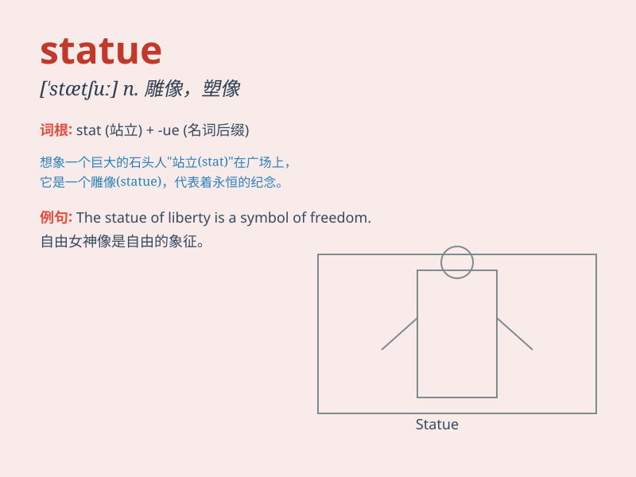

## statue

**英音:** _[ˈstætʃu:]_ **美音:** _[\'stætʃu]_

**译义:** *vt.以雕像装饰n.雕像*

### 短语

+ **bronze statue:** _青铜雕像_

+ **marble statue:** _大理石雕像_

+ **statue of liberty:** _自由女神像_

+ **public statue:** _公共雕像_

+ **religious statue:** _宗教雕像_

### 例句

#### 例句1

> **The statue of liberty is an iconic symbol of the United
States.**

**中文翻译:** 自由女神像是美国的一个标志性象征。

**单词释义:** 雕像；塑像

#### 例句2

> **There is a beautiful statue in the park.**

**中文翻译:** 公园里有一座美丽的雕像。

**单词释义:** 雕像；塑像

#### 例句3

> **The artist spent months creating the statue.**

**中文翻译:** 这位艺术家花了数月时间创作这座雕像。

**单词释义:** 雕像；塑像

### 背诵小故事

> A thief wanted to steal a precious statue in a museum. But when he
touched it, an alarm rang loudly. The statue remained safe, standing
there as a symbol of art and history.

**一个小偷想偷博物馆里一件珍贵的雕像。但当他碰到它时，警报声大作。雕像安然无恙，矗立在那里，作为艺术和历史的象征。**

### 图义

