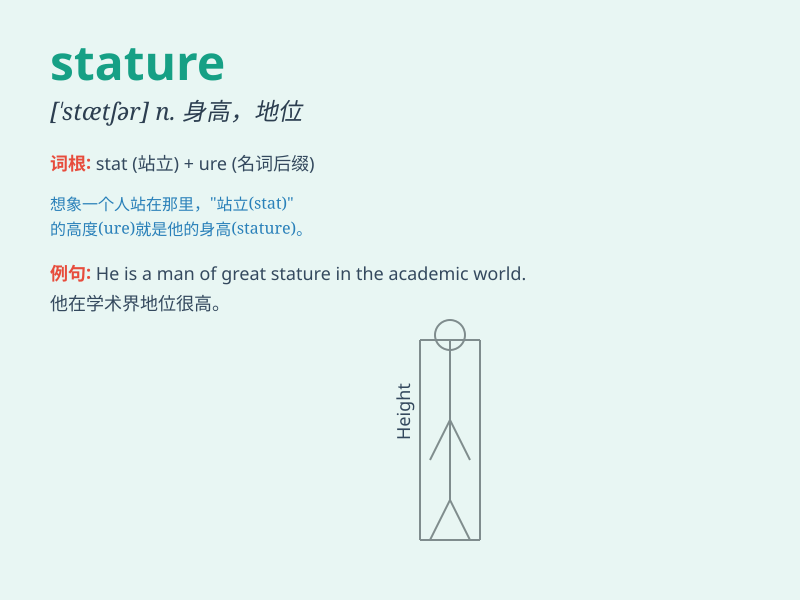

## stature

**英音:** _[\'stætʃə]_ **美音:** _[\'stætʃɚ]_

**译义:** *n.身高,身材,(精神、道德等的)高度*

### 短语

+ **low stature:** _低矮的身材_

+ **average stature:** _中等身材_

+ **tall stature:** _高大的身材_

+ **of imposing stature:** _有威严的身材_

+ **stature and build:** _身材和体格_

### 例句

#### 例句1

> **Despite his short stature, he was an excellent basketball
player.**

**中文翻译:** 尽管他身材矮小，但他是一位出色的篮球运动员。

**单词释义:** 身高；身材

#### 例句2

> **The company has achieved a great stature in the industry.**

**中文翻译:** 这家公司在该行业取得了很高的地位。

**单词释义:** 地位；声望

#### 例句3

> **Her moral stature makes her a respected figure in the
community.**

**中文翻译:** 她的道德高度使她成为社区中受人尊敬的人物。

**单词释义:** 高度；境界

### 背诵小故事

> A little boy always dreamed of having a tall stature like a
superhero. One day, he ate a lot of healthy food and exercised hard.
Finally, he grew up and achieved his desired stature.

**一个小男孩总是梦想拥有像超级英雄那样高大的身材。有一天，他吃了很多健康的食物并且努力锻炼。最后，他长大了，拥有了理想的身材。**

### 图义

