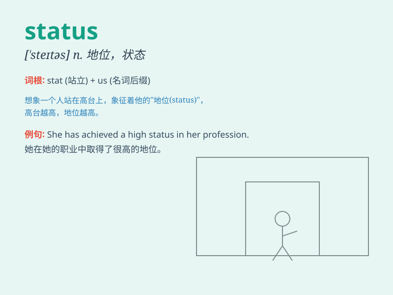

## status

**英音:** _[\'steɪtəs]_ **美音:** _[ˈstetəs]_

**译义:** *n.身份,地位,情形,状况*

### 短语

+ **social status:** _社会地位_

+ **marital status:** _婚姻状况_

+ **current status:** _当前状态_

+ **status quo:** _现状；原来的状况_

+ **economic status:** _经济地位_

### 例句

#### 例句1

> **The status of the project is still unclear.**

**中文翻译:** 这个项目的状况仍然不清楚。

**单词释义:** 状况；状态

#### 例句2

> **She is concerned about her social status.**

**中文翻译:** 她很在意自己的社会地位。

**单词释义:** 地位

#### 例句3

> **The website shows the real-time status of the flights.**

**中文翻译:** 该网站显示航班的实时状态。

**单词释义:** 状态

### 背诵小故事

> A king was always worried about his status. One day, a wise man told
him that true status comes from kindness and wisdom. The king changed
and finally gained real respect. Remember, status is not just about
power but also about character.

**一位国王总是担心他的地位。有一天，一位智者告诉他，真正的地位来自善良和智慧。国王改变了，最终获得了真正的尊重。记住，status（地位）不仅关乎权力，还关乎品格。**

### 图义

