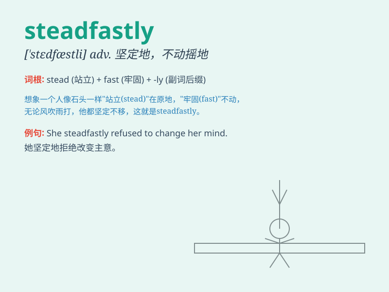

## steadfastly

**英音:** _[\'stedfɑ:stlɪ]_ **美音:** _[\'stɛd,fæstli]_

**译义:** *adv.踏实地,不变地*

### 短语

+ **steadfastly refuse:** _坚决拒绝_

+ **steadfastly support:** _坚定支持_

+ **steadfastly believe:** _坚信_

+ **steadfastly adhere to:** _坚定不移地坚持_

+ **steadfastly pursue:** _坚定不移地追求_

### 例句

#### 例句1

> **He steadfastly refused to give up his beliefs.**

**中文翻译:** 他坚定地拒绝放弃自己的信仰。

**单词释义:** 坚定地

#### 例句2

> **She worked steadfastly towards her goal, despite the many
obstacles.**

**中文翻译:** 尽管有许多障碍，她还是坚定地朝着自己的目标努力。

**单词释义:** 坚定地

#### 例句3

> **The soldier stood steadfastly at his post, even in the face of
danger.**

**中文翻译:** 这名士兵即使面对危险，也坚定地站在自己的岗位上。

**单词释义:** 坚定地

### 背诵小故事

> A brave knight stood steadfastly on the battlefield, despite the
fierce attacks. He never moved an inch, determined to protect his
kingdom. His steadfastness inspired all the soldiers.

**一位勇敢的骑士坚定地站在战场上，尽管攻击猛烈。他一寸都未移动，决心保护他的王国。他的坚定不移鼓舞了所有士兵。**

### 图义

