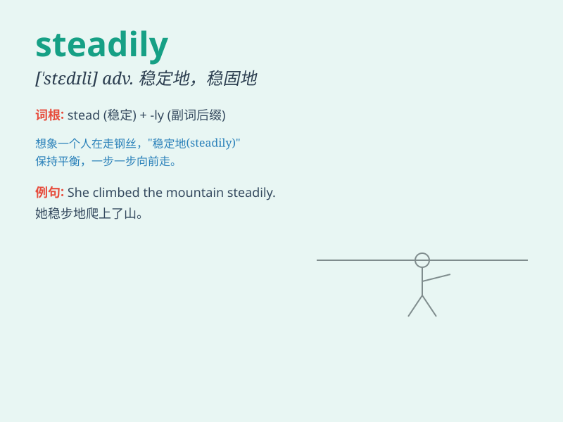

## steadily

**英音:** _[\'stedɪlɪ]_ **美音:** _[\'stɛdəli]_

**译义:** *adv.稳定地,有规则地*

### 短语

+ **move steadily:** _稳步移动_

+ **increase steadily:** _稳步增长_

+ **progress steadily:** _稳步进展_

+ **improve steadily:** _稳步提高_

+ **grow steadily:** _稳步成长_

### 例句

#### 例句1

> **The company\'s profits have grown steadily over the past few
years.**

**中文翻译:** 这家公司的利润在过去几年里稳步增长。

**单词释义:** 稳定地；持续地

#### 例句2

> **He steadily climbed the stairs to the top floor.**

**中文翻译:** 他稳步地爬上楼梯到了顶楼。

**单词释义:** 平稳地；逐步地

#### 例句3

> **The patient\'s condition improved steadily after the
operation.**

**中文翻译:** 手术后病人的状况稳步好转。

**单词释义:** 不断地；持续地

### 背诵小故事

> A little bird was learning to fly. At first, it wobbled, but then it
flew steadily across the sky. It kept its balance and moved smoothly,
showing how steadily means in a stable and continuous manner.

**一只小鸟正在学习飞翔。起初，它摇摇晃晃，但随后它稳稳地飞过天空。它保持平衡，平稳移动，展示了\'steadily\'意味着稳定、持续的方式。**

### 图义

