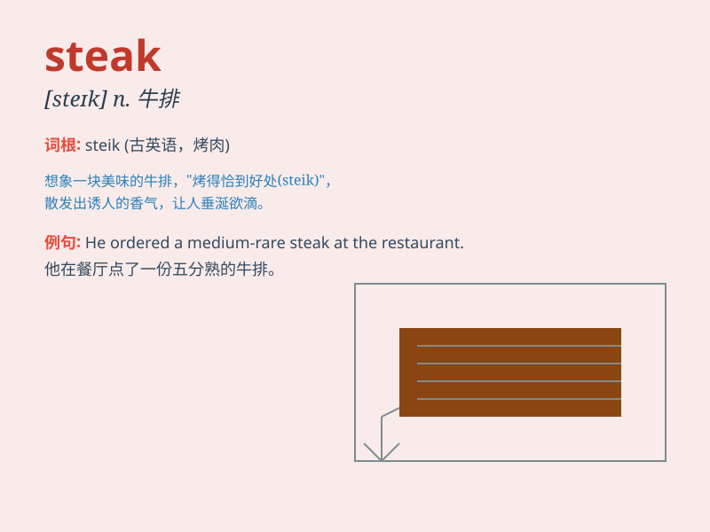

## steak

**英音:** _[steɪk]_ **美音:** _[stek]_

**译义:** *n.(供煎,烤等的)肉,鱼,肉片,鱼片,肉排,牛排*

### 短语

+ **beef steak:** _牛排_

+ **steak knife:** _牛排刀_

+ **steak tartare:** _鞑靼牛排_

+ **rare steak:** _三分熟的牛排_

+ **medium-rare steak:** _五分熟的牛排_

### 例句

#### 例句1

> **I ordered a medium-rare steak at the restaurant.**

**中文翻译:** 我在餐厅点了一份五分熟的牛排。

**单词释义:** 牛排

#### 例句2

> **The steak was so tender and juicy.**

**中文翻译:** 这块牛排非常嫩且多汁。

**单词释义:** 牛排

#### 例句3

> **He cooked the steak to perfection on the grill.**

**中文翻译:** 他在烤架上把牛排烤得恰到好处。

**单词释义:** 牛排

### 背诵小故事

> One day, I was very hungry. I went to a restaurant and ordered a big
steak. The chef cooked it perfectly. I enjoyed every bite. The steak was
so delicious that I\'ll never forget it.

**有一天，我非常饿。我去了一家餐厅，点了一份大牛排。厨师烹饪得非常完美。我享受每一口。这份牛排太美味了，以至于我永远不会忘记。**

### 图义

