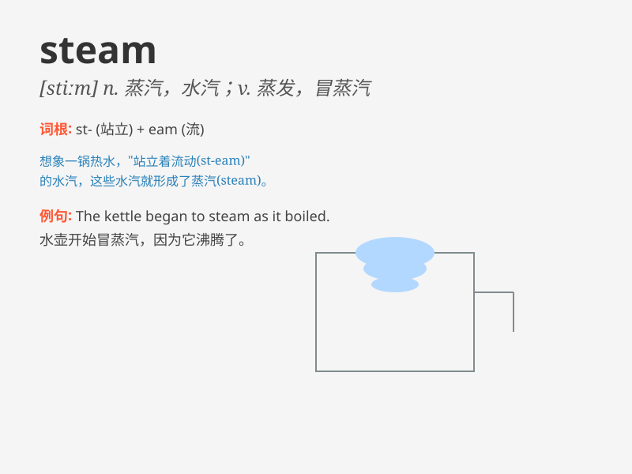

## steam

**英音:** _[stiːm]_ **美音:** _[stim]_

**译义:** *n.蒸汽,水汽vi.蒸发vt.蒸*

### 短语

+ **steam engine:** _蒸汽机_

+ **steam room:** _蒸汽浴室_

+ **steam up:** _（使）蒙上水汽；（使）充满蒸汽_

+ **steam ahead:** _全速前进；进展迅速_

+ **under steam:** _在行驶中；在运转中_

### 例句

#### 例句1

> **The steam rose from the boiling kettle.**

**中文翻译:** 蒸汽从沸腾的水壶中升起。

**单词释义:** 蒸汽

#### 例句2

> **The train runs on steam.**

**中文翻译:** 这列火车靠蒸汽运行。

**单词释义:** 蒸汽

#### 例句3

> **Steam was coming out of the vent.**

**中文翻译:** 蒸汽正从通风口冒出来。

**单词释义:** 蒸汽

### 背诵小故事

> One day, I was in a factory. I saw water boiling and turning into
steam. The steam was powerful and could drive machines. It was like
magic!

**一天，我在一个工厂里。我看到水沸腾并变成了蒸汽。蒸汽力量强大，可以驱动机器。这就像魔法一样！**

### 图义

