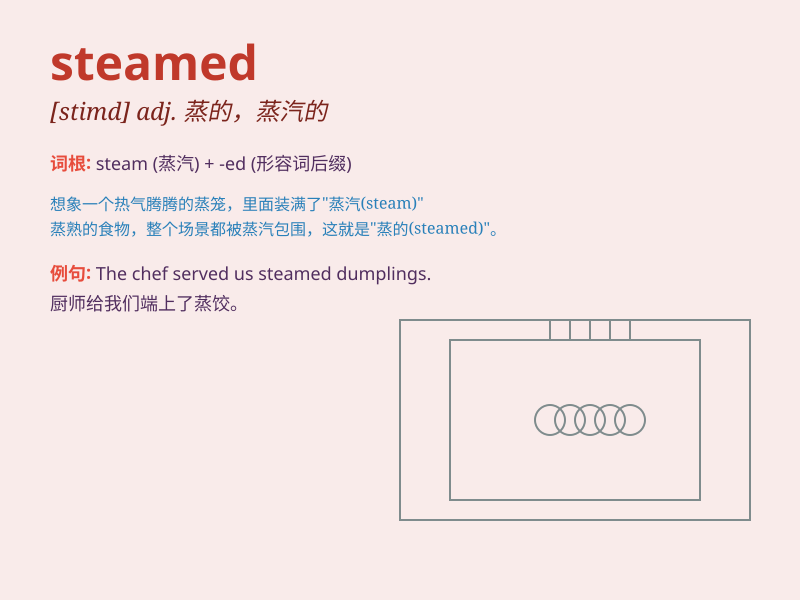

## steamed

**英音:** _[stiːmd]_ **美音:** _[stiːmd]_

**译义:** *adj.蒸的，由蒸汽处理的，闷热的
v.蒸（食物），给...用蒸汽加热，使闷热，使焦虑不安（steam的过去分词形式）*

### 短语

+ **steamed bun:** _馒头_

+ **steamed fish:** _蒸鱼_

+ **steamed rice:** _蒸米饭_

+ **steamed dumpling:** _蒸饺_

+ **steamed egg:** _蒸蛋_

### 例句

#### 例句1

> **I love eating steamed dumplings.**

**中文翻译:** 我喜欢吃蒸饺。

**单词释义:** 蒸的（形容饺子）

#### 例句2

> **The steamed fish tastes very fresh.**

**中文翻译:** 这条蒸鱼尝起来非常新鲜。

**单词释义:** 蒸的（形容鱼）

#### 例句3

> **She ordered a plate of steamed vegetables for dinner.**

**中文翻译:** 她晚餐点了一盘蒸蔬菜。

**单词释义:** 蒸的（形容蔬菜）

### 背诵小故事

> One day, I was really hungry. I went to a restaurant and ordered some
steamed dumplings. They were so delicious because they were cooked by
steam. The steam made the dumplings soft and full of flavor.

**有一天，我特别饿。我去了一家餐馆，点了一些蒸饺。它们非常美味，因为是用蒸汽蒸熟的。蒸汽让饺子变得柔软且味道十足。**

### 图义

