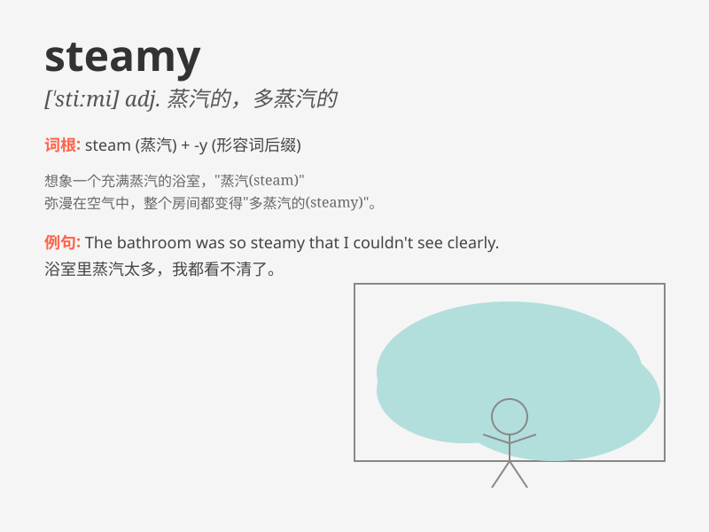

## steamy

**英音:** _[\'stiːmɪ]_ **美音:** _[\'stimi]_

**译义:** *adj.蒸汽的,多蒸汽的*

### 短语

+ **steamy romance:** _充满激情的浪漫_

+ **steamy weather:** _闷热的天气_

+ **steamy novel:** _香艳的小说_

+ **steamy bathroom:** _雾气腾腾的浴室_

+ **steamy scene:** _激情的场景_

### 例句

#### 例句1

> **The steamy bathroom made the mirror foggy.**

**中文翻译:** 充满蒸汽的浴室让镜子起雾了。

**单词释义:** 充满蒸汽的

#### 例句2

> **They enjoyed a steamy night in the tropical resort.**

**中文翻译:** 他们在热带度假胜地度过了一个激情火热的夜晚。

**单词释义:** 激情火热的

#### 例句3

> **The steamy romance novel was a bestseller.**

**中文翻译:** 那本充满激情的爱情小说是畅销书。

**单词释义:** 充满激情的

### 背诵小故事

> One hot summer day, I walked into a small room. It was steamy inside,
like a sauna. The air was thick with moisture and made me sweat a lot. I
realized \'steamy\' means hot and humid.

**在一个炎热的夏日，我走进一个小房间。里面热气腾腾，就像桑拿房一样。空气充满了湿气，让我大汗淋漓。我明白了'steamy'意思是又热又潮湿。**

### 图义

