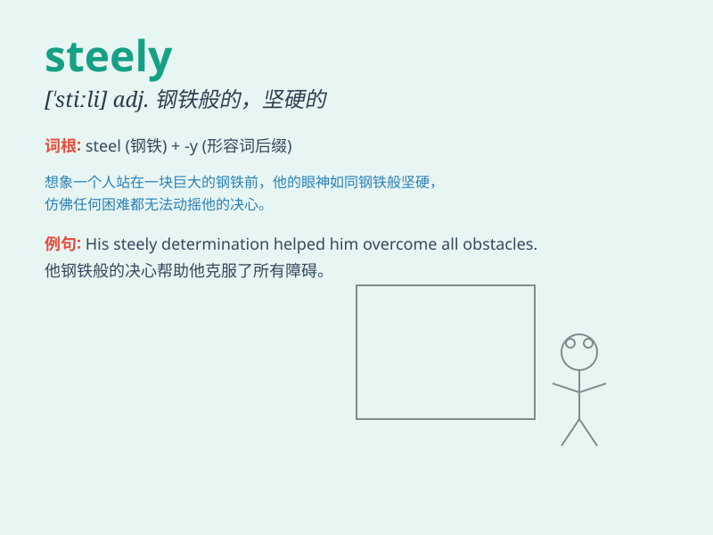

## steely

**英音:** _[\'stiːlɪ]_ **美音:** _[\'stili]_

**译义:** *adj.似钢的*

### 短语

+ **steely determination:** _钢铁般的决心_

+ **steely gaze:** _冷峻的目光_

+ **steely nerves:** _钢铁般的神经（指坚强的意志）_

+ **steely resolve:** _坚定的决心_

+ **steely strength:** _钢铁般的力量_

### 例句

#### 例句1

> **He looked at me with steely eyes.**

**中文翻译:** 他用冷酷的眼神看着我。

**单词释义:** 冷酷的；强硬的

#### 例句2

> **She showed a steely determination to succeed.**

**中文翻译:** 她展现出了坚定的成功决心。

**单词释义:** 坚定的；刚强的

#### 例句3

> **The steely grip of the law must be maintained.**

**中文翻译:** 必须维持法律的严格控制。

**单词释义:** 严格的；强硬的

### 背诵小故事

> A brave knight faced a huge dragon. His eyes were steely, showing no
fear. With a steely determination, he raised his sword and charged
forward. The steely look in his eyes made the dragon hesitate.

**一位勇敢的骑士面对一只巨大的龙。他的眼神坚定如钢，毫无惧色。带着钢铁般的决心，他举起剑向前冲去。他那如钢般的眼神让龙犹豫了。**

### 图义

