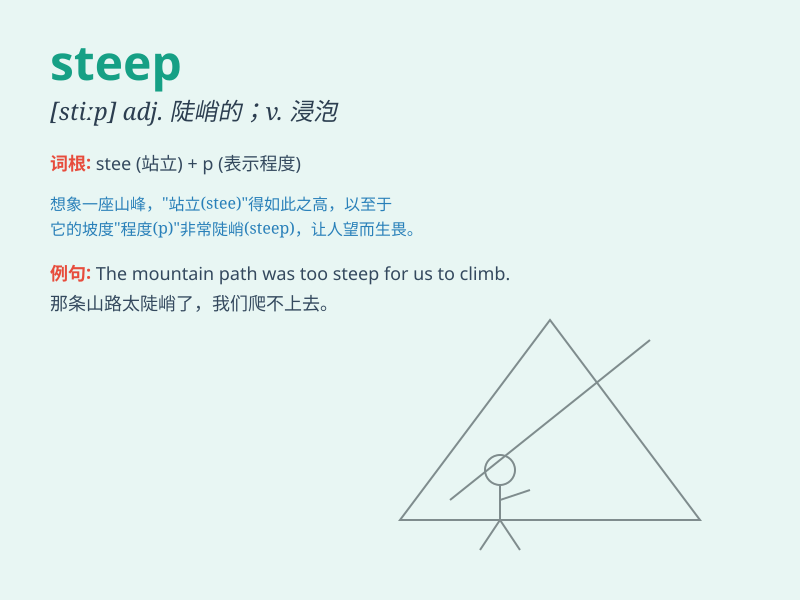

## steep

**英音:** _[stiːp]_ **美音:** _[stip]_

**译义:**
*adj.陡峭的,险峻的,急剧升降的,不合理的n.悬崖,峭壁,浸渍,浸渍液v.浸,泡,沉浸*

### 短语

+ **steep slope:** _陡坡_

+ **steep price:** _高昂的价格_

+ **steep learning curve:** _陡峭的学习曲线_

+ **steep rise:** _急剧上升_

+ **steep decline:** _急剧下降_

### 例句

#### 例句1

> **The road is very steep, so be careful when driving.**

**中文翻译:** 这条路非常陡峭，所以开车时要小心。

**单词释义:** 陡峭的

#### 例句2

> **The price of the new car is too steep for me to afford.**

**中文翻译:** 这辆新车的价格太高，我买不起。

**单词释义:** 过高的；过分的

#### 例句3

> **She steeped the tea leaves in hot water for a few minutes.**

**中文翻译:** 她把茶叶在热水里浸泡了几分钟。

**单词释义:** 浸泡；浸透

### 背诵小故事

> A brave climber was trying to reach the top of a mountain. The path
was very steep. He had to use all his strength and skills. But finally,
he made it. The word \'steep\' describes such a difficult and sharply
rising path.

**一位勇敢的登山者试图到达山顶。道路非常陡峭。他不得不使出浑身解数。但最终，他成功了。单词\'steep\'描述的就是这样艰难且急剧上升的道路。**

### 图义

