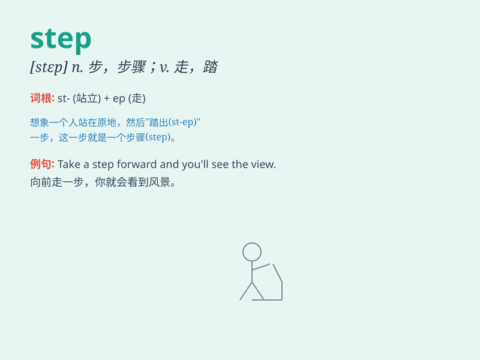

## step

**英音:** _[step]_ **美音:** _[stɛp]_

**译义:**
*n.脚步,步幅,步调,步伐,步骤,措施,梯级,台阶v.走,举步,移步,踏
产品数据转换规范*

### 短语

+ **step by step:** _逐步地；一步一步地_

+ **step forward:** _向前走；站出来_

+ **step up:** _增加；提高；走近_

+ **in step:** _协调；同步；合拍_

+ **out of step:** _不合拍；不协调_

### 例句

#### 例句1

> **She took a step forward.**

**中文翻译:** 她向前迈了一步。

**单词释义:** 步；脚步

#### 例句2

> **The first step in solving the problem is to admit there is
one.**

**中文翻译:** 解决这个问题的第一步是承认存在问题。

**单词释义:** 步骤；措施

#### 例句3

> **He heard steps in the corridor.**

**中文翻译:** 他听到走廊里有脚步声。

**单词释义:** 脚步声

### 背诵小故事

> One day, Tom was in a hurry to catch the bus. He had to take many
steps to reach the bus stop. Each step was a challenge, but he finally
made it.

**一天，汤姆急着赶公交车。他必须走很多步才能到达公交站。每一步都是一个挑战，但他最终成功了。**

### 图义

