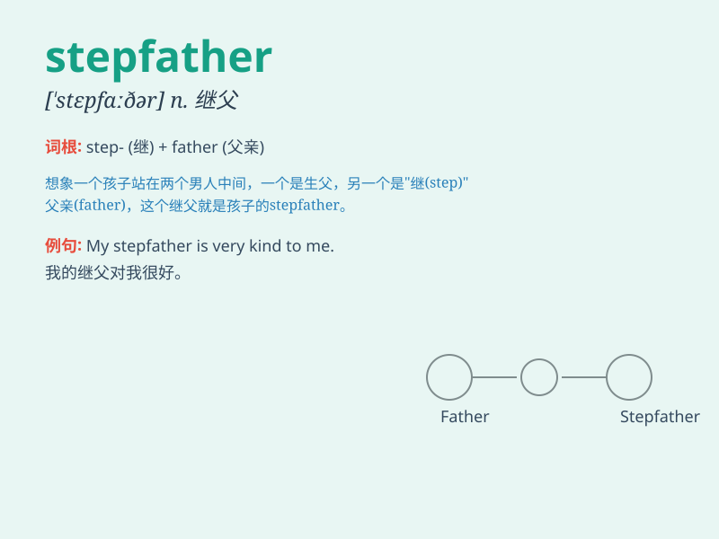

## stepfather

**英音:** _[\'stepfɑːðə]_ **美音:** _[\'stɛpfɑðɚ]_

**译义:** *n.继父*

### 短语

+ **stepfather and mother:** _继父和母亲_

+ **live with stepfather:** _和继父一起生活_

+ **visit stepfather:** _拜访继父_

+ **get along with stepfather:** _与继父相处_

+ **respect stepfather:** _尊敬继父_

### 例句

#### 例句1

> **My stepfather is very kind to me.**

**中文翻译:** 我的继父对我非常好。

**单词释义:** 继父

#### 例句2

> **I have a great relationship with my stepfather.**

**中文翻译:** 我和我的继父关系很好。

**单词释义:** 继父

#### 例句3

> **Her stepfather supports her in everything she does.**

**中文翻译:** 她的继父在她做的每件事上都支持她。

**单词释义:** 继父

### 背诵小故事

> Once upon a time, a little girl had a stepfather. Her real father was
gone. But this new man came into her life, trying to be a father figure.
Though not her biological dad, he took steps to care for her.

**从前，有个小女孩有了一个继父。她的生父离开了。但这个新男人走进了她的生活，努力扮演父亲的角色。虽然不是她的亲生父亲，但他一步步地关心着她。**

### 图义

