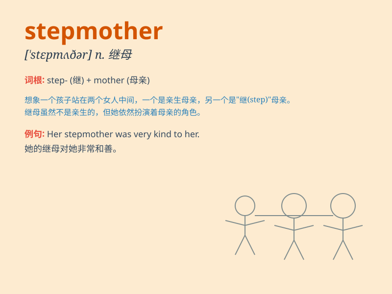

## stepmother

**英音:** _[\'stepmʌðə]_ **美音:** _[\'stɛpmʌðɚ]_

**译义:** *n.继母*

### 短语

+ **wicked stepmother:** _邪恶的继母_

+ **cruel stepmother:** _残忍的继母_

+ **loving stepmother:** _有爱心的继母_

+ **stepmother figure:** _继母般的人物_

+ **new stepmother:** _新继母_

### 例句

#### 例句1

> **My stepmother is very kind to me.**

**中文翻译:** 我的继母对我非常好。

**单词释义:** 继母

#### 例句2

> **I don\'t get along well with my stepmother.**

**中文翻译:** 我和我的继母相处得不好。

**单词释义:** 继母

#### 例句3

> **Her stepmother always criticizes her.**

**中文翻译:** 她的继母总是批评她。

**单词释义:** 继母

### 背诵小故事

> Once upon a time, there was a girl whose father married another
woman. This new woman in the family was not as kind as her real mother.
She was the girl\'s stepmother, who often made the girl do lots of
chores.

**从前，有个女孩，她的父亲娶了另一个女人。这个家里的新女人不像她的亲生母亲那样和蔼。她就是女孩的继母，经常让女孩做很多家务。**

### 图义

