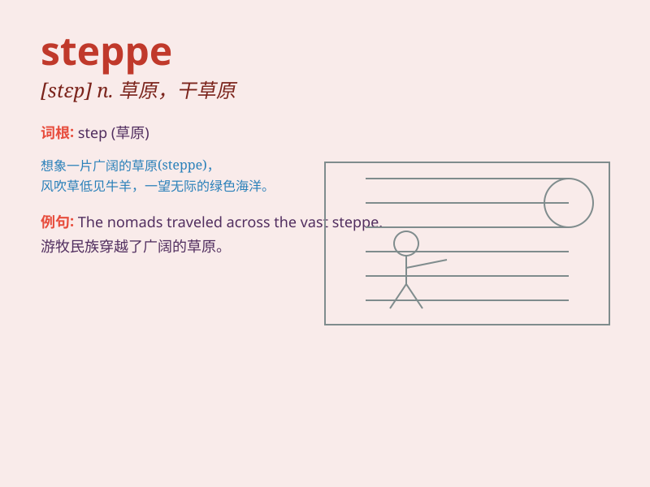

## steppe

**英音:** _[step]_ **美音:** _[stɛp]_

**译义:** *n.特指西伯利亚一带没有树木的大草原*

### 短语

+ **the Eurasian steppe:** _欧亚大草原_

+ **steppe climate:** _草原气候_

+ **steppe grassland:** _草原草地_

+ **steppe zone:** _草原地带_

+ **steppe ecosystem:** _草原生态系统_

### 例句

#### 例句1

> **The nomads roamed the vast steppe in search of fresh
pastures.**

**中文翻译:** 游牧民在广袤的草原上游荡，寻找新鲜的牧场。

**单词释义:** 草原

#### 例句2

> **The steppe was covered with wildflowers in the spring.**

**中文翻译:** 春天，草原上开满了野花。

**单词释义:** 草原

#### 例句3

> **He set out on a journey across the steppe to reach the distant
mountains.**

**中文翻译:** 他踏上了穿越草原的旅程，以到达远处的山脉。

**单词释义:** 草原

### 背诵小故事

> A brave adventurer was lost on the vast steppe. With no trees in
sight, only endless grass. But he didn\'t panic. He followed the wind
direction and finally found his way out. Remember, steppe means a large
area of grassland!

**一位勇敢的冒险家在广袤的草原上迷路了。放眼望去没有树木，只有一望无际的草。但他没有惊慌。他顺着风向，最终找到了出路。记住，steppe
意思是大草原！**

### 图义

