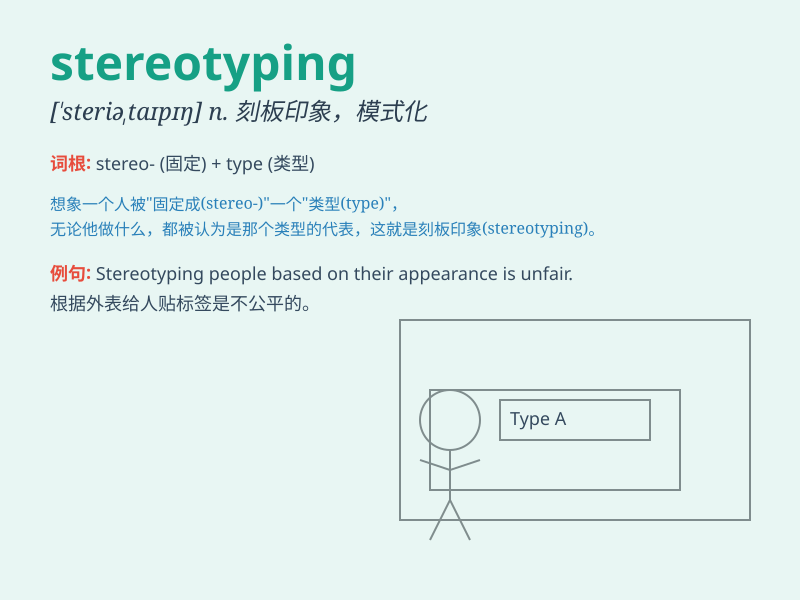

## stereotyping

**英音:** _[ˈstɛrɪəˌtaɪpɪŋ]_ **美音:**
_[ˈstɛriəˌtaɪpɪŋ]_

**译义:** *n. 刻板印象，成见；对...形成固定看法*

### 短语

+ **gender stereotyping:** _性别刻板印象_

+ **racial stereotyping:** _种族刻板印象_

+ **avoid stereotyping:** _避免刻板印象_

+ **break down stereotyping:** _打破刻板印象_

+ **fall victim to stereotyping:** _成为刻板印象的受害者_

### 例句

#### 例句1

> **The media is often accused of stereotyping certain groups of
people.**

**中文翻译:** 媒体经常被指责对某些人群有成见。

**单词释义:** 对\...\...有成见

#### 例句2

> **We should avoid stereotyping based on gender or race.**

**中文翻译:** 我们应该避免基于性别或种族的刻板印象。

**单词释义:** 形成刻板印象

#### 例句3

> **Stereotyping can lead to unfair treatment and discrimination.**

**中文翻译:** 刻板印象会导致不公平的对待和歧视。

**单词释义:** 刻板印象；成见

### 背诵小故事

> Imagine a group of people always judging others based on fixed ideas.
They are\'stereotyping\' others, like thinking all artists are wild.
This wrong way of seeing others is what the word means.

**想象有一群人总是根据固定的想法来评判他人。他们正在"刻板地给他人归类定型"，比如认为所有艺术家都很狂野。这种错误看待他人的方式就是这个单词的意思。**

### 图义

