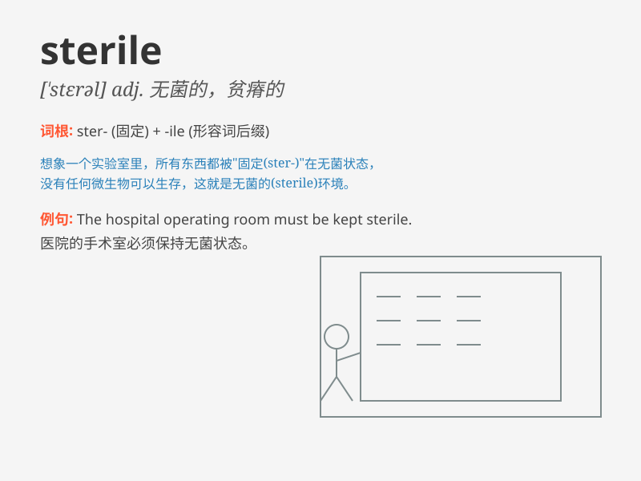

## sterile

**英音:** _[\'steraɪl]_ **美音:** _[\'stɛrəl]_

**译义:** *adj.贫脊的,不育的,不结果的,消过毒的,毫无结果的*

### 短语

+ **sterile field:** _无菌区_

+ **sterile water:** _无菌水_

+ **sterile technique:** _无菌技术_

+ **sterile environment:** _无菌环境_

+ **sterile equipment:** _无菌设备_

### 例句

#### 例句1

> **The operating room must be kept sterile to prevent infection.**

**中文翻译:** 手术室必须保持无菌以防止感染。

**单词释义:** 无菌的

#### 例句2

> **The land was sterile and could not support much vegetation.**

**中文翻译:** 这片土地贫瘠，不能供养太多的植被。

**单词释义:** 贫瘠的

#### 例句3

> **Their marriage remained sterile after many years of trying to
have a child.**

**中文翻译:** 他们的婚姻多年来一直没有孩子，毫无成果。

**单词释义:** 无结果的；无成效的

### 背诵小故事

>
想象在一个无菌的实验室里，科学家们穿着白色的无菌服，周围的一切都sterile，没有细菌，没有污染。他们的工作环境干净、纯净，因为sterile意味着无菌的、不能生育的、贫瘠的。

**想象在一个无菌的实验室里，科学家们穿着无菌服，周围一切都无菌、无生育能力、贫瘠。解释了sterile的含义。**

### 图义

