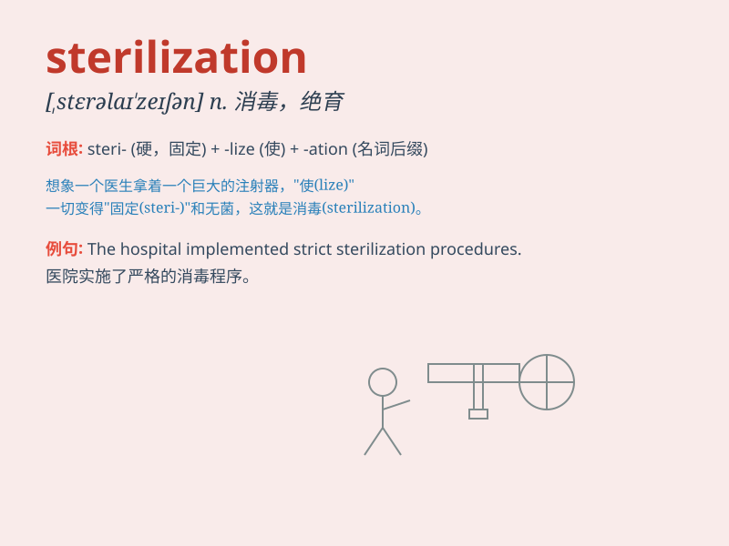

## sterilization

**英音:** _[ˌsterəlaɪˈzeɪʃn]_ **美音:**
_[ˌsterələˈzeɪʃn]_

**译义:** *n.杀菌；绝育；消毒*

### 短语

+ **sterilization equipment:** _消毒设备_

+ **sterilization process:** _灭菌过程_

+ **female sterilization:** _女性绝育_

+ **sterilization chamber:** _消毒室_

+ **sterilization method:** _灭菌方法_

### 例句

#### 例句1

> **The hospital has strict procedures for sterilization of surgical
equipment.**

**中文翻译:** 这家医院对手术设备的消毒有严格的程序。

**单词释义:** 消毒

#### 例句2

> **Sterilization is an important measure to prevent the spread of
diseases.**

**中文翻译:** 消毒是防止疾病传播的重要措施。

**单词释义:** 消毒；灭菌

#### 例句3

> **The process of sterilization ensures the safety of food
products.**

**中文翻译:** 灭菌过程确保了食品的安全。

**单词释义:** 灭菌

### 背诵小故事

> A doctor was explaining the importance of sterilization to a group of
trainees. He showed them how to sterilize tools to prevent the spread of
germs. \'Sterilization makes everything clean and safe!\' he said.

**一位医生正在向一群实习生解释消毒的重要性。他向他们展示如何对工具进行消毒以防止细菌传播。他说："消毒能让一切变得干净和安全！"**

### 图义

