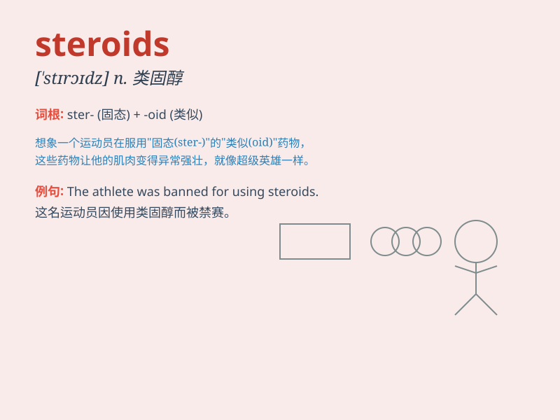

## steroids

**英音:** _[ˈsteroɪdz]_ **美音:** _[ˈsteroɪdz]_

**译义:**
*n.类固醇，甾（一种有机化合物，具有特定的环状结构，包括天然存在的如性激素和胆固醇以及合成的药物）*

### 短语

+ **anabolic steroids:** _合成代谢类固醇；促蛋白合成甾类_

+ **steroids injection:** _类固醇注射_

+ **steroids cream:** _类固醇乳膏_

+ **performance-enhancing steroids:** _提高运动成绩的类固醇_

+ **steroids abuse:** _类固醇滥用_

### 例句

#### 例句1

> **He was caught using steroids to enhance his performance in the
competition.**

**中文翻译:** 他被发现使用类固醇来提高他在比赛中的表现。

**单词释义:** 类固醇

#### 例句2

> **The athlete was banned for taking steroids.**

**中文翻译:** 这位运动员因服用类固醇而被禁赛。

**单词释义:** 类固醇

#### 例句3

> **Doctors warn against the misuse of steroids.**

**中文翻译:** 医生警告不要滥用类固醇。

**单词释义:** 类固醇

### 背诵小故事

> A strong athlete was suspected of using steroids to enhance his
performance. But his coach found out and stopped him, saying it\'s
cheating. Remember, steroids are not the right way to success.

**一位强壮的运动员被怀疑使用类固醇来提高他的表现。但他的教练发现并制止了他，说这是作弊。记住，类固醇不是通向成功的正确途径。**

### 图义

