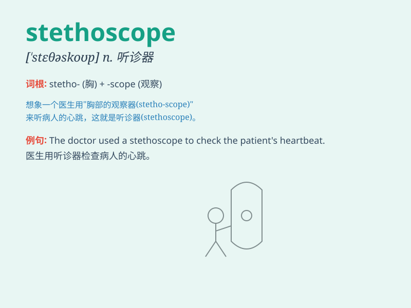

## stethoscope

**英音:** _[\'steθəskəʊp]_ **美音:** _[\'stɛθəskop]_

**译义:** *n.听诊器vt.用听诊器诊断*

### 短语

+ **electronic stethoscope:** _电子听诊器_

+ **dual-head stethoscope:** _双头听诊器_

+ **cardiac stethoscope:** _心脏听诊器_

+ **pediatric stethoscope:** _儿科听诊器_

+ **fetal stethoscope:** _胎儿听诊器_

### 例句

#### 例句1

> **The doctor used a stethoscope to listen to the patient\'s
heart.**

**中文翻译:** 医生用听诊器听病人的心脏。

**单词释义:** 听诊器

#### 例句2

> **She picked up the stethoscope and began her examination.**

**中文翻译:** 她拿起听诊器开始检查。

**单词释义:** 听诊器

#### 例句3

> **The stethoscope is an essential tool for a cardiologist.**

**中文翻译:** 听诊器是心脏病专家的必备工具。

**单词释义:** 听诊器

### 背诵小故事

> A doctor was very worried because he lost his stethoscope. But then a
kind nurse found it and gave it back. The doctor was happy and could
listen to patients\' hearts again.

**一位医生非常担心，因为他丢了他的听诊器。但后来一位善良的护士找到了它并归还。医生很高兴，又能听病人的心跳了。**

### 图义

