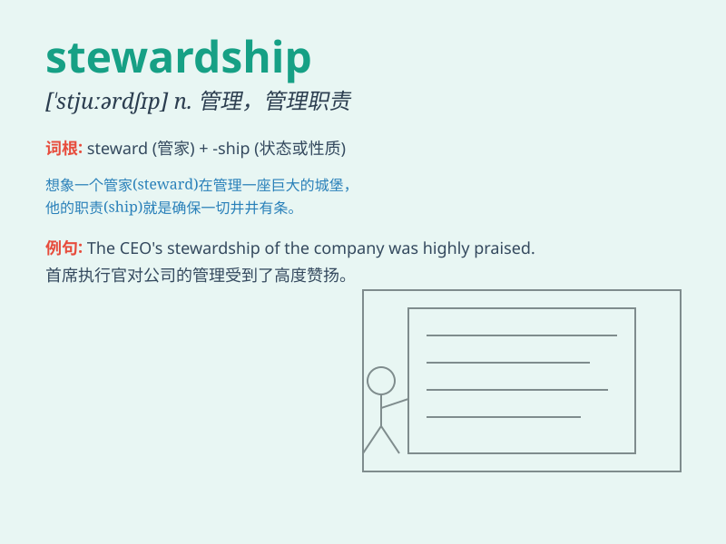

## stewardship

**英音:** _[\'stjuːədʃɪp]_ **美音:** _[\'stuɚdʃɪp]_

**译义:** *n.乘务员(服务员)的职位,工作*

### 短语

+ **environmental stewardship:** _环境管理_

+ **corporate stewardship:** _企业管理责任_

+ **resource stewardship:** _资源管理_

+ **stewardship theory:** _管理理论_

+ **land stewardship:** _土地管理_

### 例句

#### 例句1

> **Good stewardship of the environment is everyone\'s
responsibility.**

**中文翻译:** 对环境的良好管理是每个人的责任。

**单词释义:** 管理；看管；组织工作

#### 例句2

> **The company prides itself on its stewardship of natural
resources.**

**中文翻译:** 这家公司为其对自然资源的管理而自豪。

**单词释义:** 管理；监管

#### 例句3

> **His stewardship of the project led to its successful
completion.**

**中文翻译:** 他对这个项目的组织工作使其成功完成。

**单词释义:** 组织工作；管理工作

### 背诵小故事

> A king appointed a wise man as the steward. The steward took good
care of the kingdom\'s resources, showing excellent stewardship. He
managed finances, protected the land, and made the kingdom prosperous.
Remember, stewardship means the careful and responsible management of
something.

**一位国王任命了一位智者作为管家。这位管家精心照料王国的资源，展现出了出色的管理才能。他管理财务、保护土地，使王国繁荣昌盛。记住，stewardship
意思是对某物的精心和负责的管理。**

### 图义

