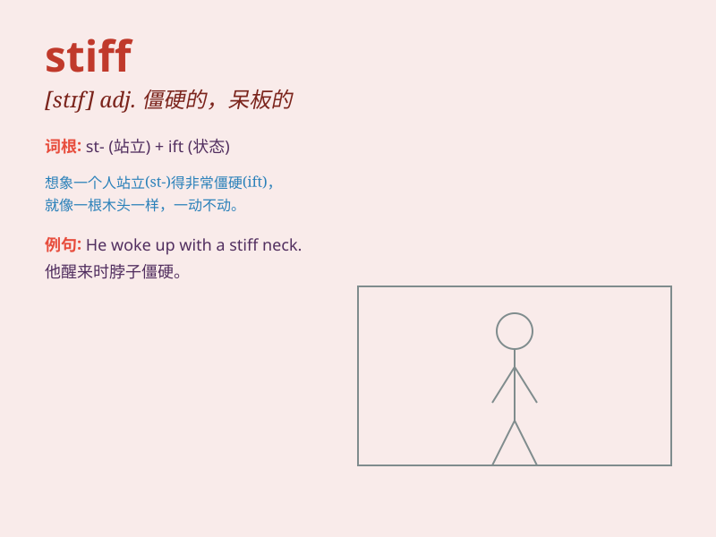

## stiff

**英音:** _[stɪf]_ **美音:** _[stɪf]_

**译义:** *adj.硬的,僵直的,拘谨的,呆板的,艰难的,费劲的,僵硬的*

### 短语

+ **stiff competition:** _激烈的竞争_

+ **stiff upper lip:** _坚定沉着；坚定不移_

+ **stiff penalty:** _严厉的惩罚_

+ **stiff breeze:** _强风_

+ **stiff neck:** _脖子僵硬_

### 例句

#### 例句1

> **The paintbrush was stiff and difficult to use.**

**中文翻译:** 这把画笔很僵硬，很难使用。

**单词释义:** 僵硬的

#### 例句2

> **He received a stiff fine for speeding.**

**中文翻译:** 他因超速收到了高额罚款。

**单词释义:** 高额的；严厉的

#### 例句3

> **After sitting for hours, my legs felt stiff.**

**中文翻译:** 坐了几个小时后，我的腿感觉僵硬了。

**单词释义:** 僵硬的；不灵活的

### 背诵小故事

> A man was walking in a stiff wind. His body became stiff as he
struggled to move forward. Suddenly, he found a stiff chair and sat down
to rest.

**一个男人在凛冽的风中行走。他的身体变得僵硬，艰难地向前移动。突然，他发现了一把硬邦邦的椅子，然后坐下来休息。**

### 图义

