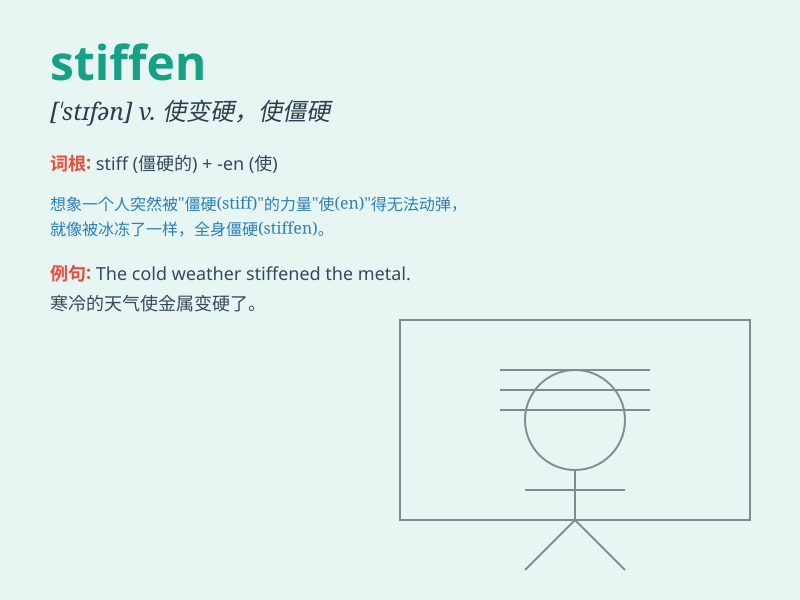

## stiffen

**英音:** _[\'stɪf(ə)n]_ **美音:** _[\'stɪfn]_

**译义:** *vt.使硬,使僵硬,使生硬,使粘稠vi.变粘,变硬,变猛烈*

### 短语

+ **stiffen up:** _变得僵硬；挺直身子_

+ **stiffen the sinews:** _鼓起勇气；下定决心_

+ **stiffen resistance:** _加强抵抗_

+ **stiffen the penalty:** _加重处罚_

+ **stiffen one\'s resolve:** _坚定决心_

### 例句

#### 例句1

> **The cold wind made her stiffen up.**

**中文翻译:** 寒风使她变得僵硬。

**单词释义:** （身体）变得僵硬

#### 例句2

> **He stiffened his resolve to finish the project on time.**

**中文翻译:** 他坚定了按时完成项目的决心。

**单词释义:** 使坚定；使下定决心

#### 例句3

> **The fabric stiffens after being washed several times.**

**中文翻译:** 这种布料洗了几次之后变硬了。

**单词释义:** （使）变硬

### 背诵小故事

> A young tailor was working on a dress. To make the fabric stiffen and
hold its shape, he applied a special solution. The process of making the
fabric become firm and less flexible was called \'stiffen\'.

**一位年轻的裁缝正在制作一件连衣裙。为了让布料变硬并保持形状，他使用了一种特殊的溶液。使布料变得坚固且不那么柔韧的这个过程就叫做'stiffen'。**

### 图义

