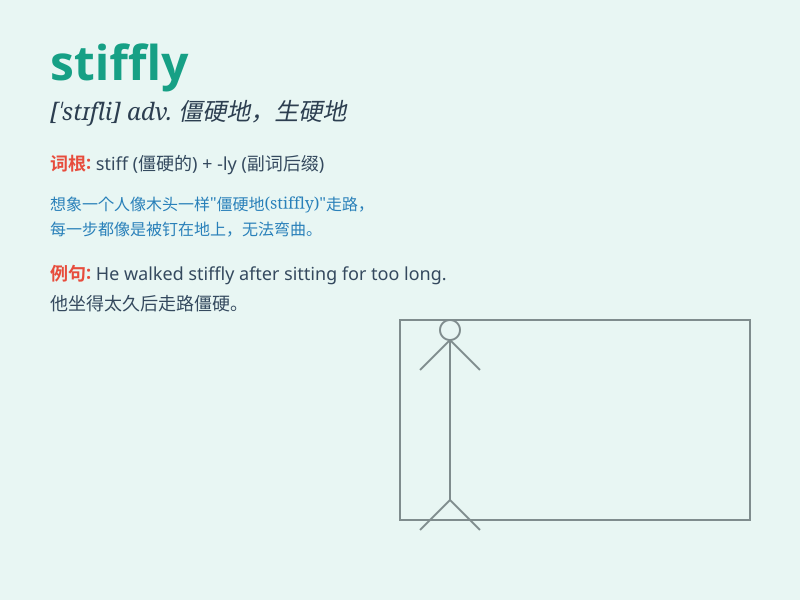

## stiffly

**英音:** _[\'stɪfli]_ **美音:** _[\'stɪfli]_

**译义:** *adv.顽固地,呆板地,僵硬地*

### 短语

+ **stand stiffly:** _僵硬地站立_

+ **move stiffly:** _生硬地移动_

+ **bend stiffly:** _僵硬地弯曲_

+ **nod stiffly:** _生硬地点头_

+ **turn stiffly:** _生硬地转身_

### 例句

#### 例句1

> **She stood stiffly, not moving a muscle.**

**中文翻译:** 她僵硬地站着，一动不动。

**单词释义:** 僵硬地

#### 例句2

> **He answered stiffly, showing no emotion.**

**中文翻译:** 他生硬地回答，没有表露任何情感。

**单词释义:** 生硬地

#### 例句3

> **The door opened stiffly as if it needed oiling.**

**中文翻译:** 门开得很费劲，好像需要上油了。

**单词释义:** 费劲地

### 背诵小故事

> A robot moved stiffly in the factory. Its joints were not flexible,
and it walked and worked stiffly. This scene made people clearly
understand the meaning of \'stiffly\', which means in a stiff or
inflexible manner.

**一个机器人在工厂里动作僵硬地移动。它的关节不灵活，走路和工作都很僵硬。这个场景让人清楚地理解了\'stiffly\'的意思，即僵硬地、不灵活地。**

### 图义

