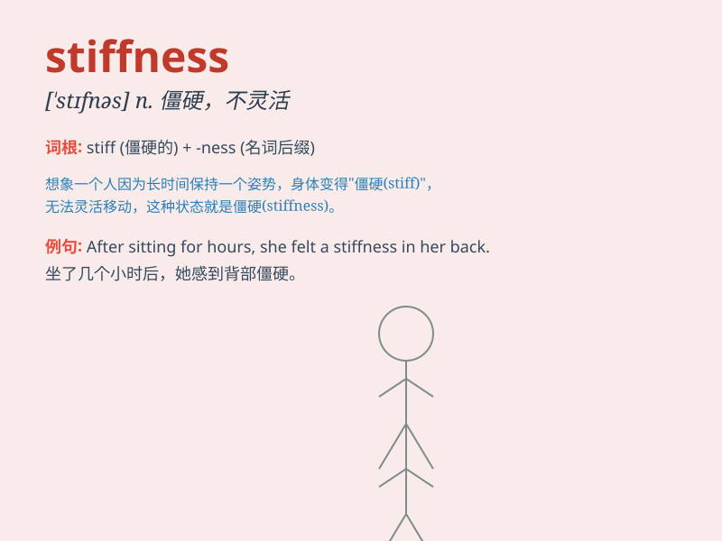

## stiffness

**英音:** _[\'stɪfnɪs]_ **美音:** _[\'stɪfnɪs]_

**译义:** *n.坚硬,硬度*

### 短语

+ **axial stiffness:** _轴向刚度_

+ **bending stiffness:** _抗弯刚度_

+ **torsional stiffness:** _抗扭刚度_

+ **stiffness coefficient:** _刚度系数_

+ **structural stiffness:** _结构刚度_

### 例句

#### 例句1

> **The stiffness in his joints made it difficult for him to move
freely.**

**中文翻译:** 他关节的僵硬使他难以自由活动。

**单词释义:** 僵硬；硬度

#### 例句2

> **The stiffness of the new fabric gave it a unique texture.**

**中文翻译:** 这种新织物的硬度赋予了它独特的质地。

**单词释义:** 硬度；刚性

#### 例句3

> **She complained about the stiffness of the mattress.**

**中文翻译:** 她抱怨床垫太硬。

**单词释义:** 硬；僵硬

### 背诵小故事

> A robot was moving awkwardly because of stiffness in its joints. It
struggled to perform tasks smoothly. This stiffness made it seem very
clumsy. Poor robot!

**一个机器人由于关节僵硬而动作笨拙。它很难顺利地执行任务。这种僵硬让它看起来非常笨拙。可怜的机器人！**

### 图义

