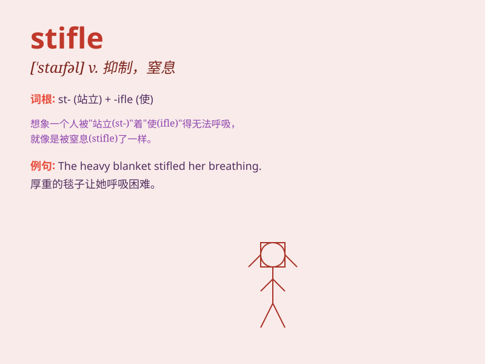

## stifle

**英音:** _[\'staɪf(ə)l]_ **美音:** _[\'staɪfl]_

**译义:** *vt.使窒息,抑制vi.窒息,闷死*

### 短语

+ **stifle creativity:** _扼杀创造力_

+ **stifle a yawn:** _忍住哈欠_

+ **stifle competition:** _抑制竞争_

+ **stifle an uprising:** _镇压起义_

+ **stifle one\'s emotions:** _抑制某人的情绪_

### 例句

#### 例句1

> **The government\'s policies are stifling economic growth.**

**中文翻译:** 政府的政策正在抑制经济增长。

**单词释义:** 抑制；遏制

#### 例句2

> **She tried to stifle a yawn during the meeting.**

**中文翻译:** 她在会议期间努力忍住不打哈欠。

**单词释义:** 忍住；抑制

#### 例句3

> **The smoke from the fire stifled the firefighters.**

**中文翻译:** 火灾产生的烟雾使消防员透不过气来。

**单词释义:** 使窒息；使呼吸困难

### 背诵小故事

>
想象一下，你在一个小房间里，空气不流通，让你感到窒息（stifle）。就像被捂住了口鼻，无法顺畅呼吸。这种难受的感觉就是
stifle 的体现。

**想象在小房间里因空气不流通而感到窒息的情景来辅助理解 stifle
这个单词，意思是使窒息、扼杀、抑制**

### 图义

