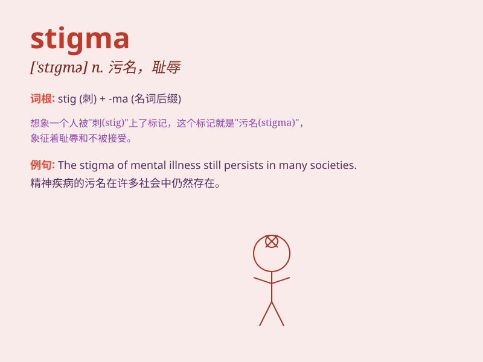

## stigma

**英音:** _[\'stɪgmə]_ **美音:** _[\'stɪɡmə]_

**译义:** *n.污名,(植物)柱头,[动物] 气门,耻辱*

### 短语

+ **social stigma:** _社会污名_

+ **mental health stigma:** _心理健康污名_

+ **erase the stigma:** _消除污名_

+ **bear the stigma:** _承受污名_

+ **stigmatize someone:** _污蔑某人_

### 例句

#### 例句1

> **There is still a stigma attached to mental illness.**

**中文翻译:** 对于精神疾病仍然存在着一种污名。

**单词释义:** 污名；耻辱

#### 例句2

> **The stigma of being a criminal can follow a person for life.**

**中文翻译:** 罪犯的污名可能伴随一个人一生。

**单词释义:** 耻辱的标记；污点

#### 例句3

> **She tried to overcome the stigma of her past mistakes.**

**中文翻译:** 她试图克服过去错误带来的耻辱。

**单词释义:** 耻辱；污名

### 背诵小故事

> A beautiful flower was wrongly stigmatized as poisonous. But a brave
botanist proved its innocence. The flower\'s true beauty was finally
recognized, and the stigma was removed. Remember, stigma means a mark of
disgrace.

**一朵美丽的花被错误地污蔑为有毒。但一位勇敢的植物学家证明了它的清白。这朵花的真正美丽终于得到认可，污蔑也消除了。记住，stigma
意思是耻辱的标记。**

### 图义

