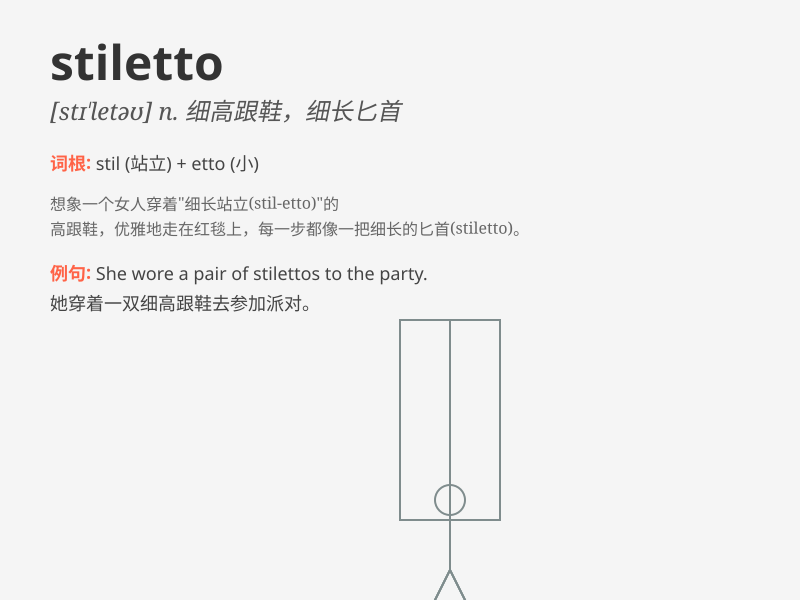

## stiletto

**英音:** _[stɪ\'letəʊ]_ **美音:** _[stɪ\'lɛto]_

**译义:** *n.一种小剑,打孔,钻孔锥*

### 短语

+ **stiletto heel:** _细高跟鞋跟_

+ **stiletto knife:** _短剑；细刃刀_

+ **stiletto point:** _细尖；尖点_

+ **stiletto attack:** _突然袭击；猛刺式攻击_

+ **stiletto shoe:** _细高跟鞋_

### 例句

#### 例句1

> **She wore a pair of stiletto heels to the party.**

**中文翻译:** 她穿着一双细高跟鞋去参加聚会。

**单词释义:** 细高跟鞋

#### 例句2

> **The stiletto was hidden in the drawer.**

**中文翻译:** 那把匕首藏在抽屉里。

**单词释义:** 匕首

#### 例句3

> **The stiletto of the building reached towards the sky.**

**中文翻译:** 这座建筑的尖顶直插云霄。

**单词释义:** 尖顶

### 背诵小故事

> A thief was trying to break into a house at night. Suddenly, the
owner appeared and threw a stiletto shoe at the thief. The sharp heel of
the stiletto scared the thief away.

**一个小偷在晚上试图闯入一所房子。突然，房主出现并朝小偷扔了一只细高跟鞋。细高跟鞋锋利的鞋跟把小偷吓跑了。**

### 图义

