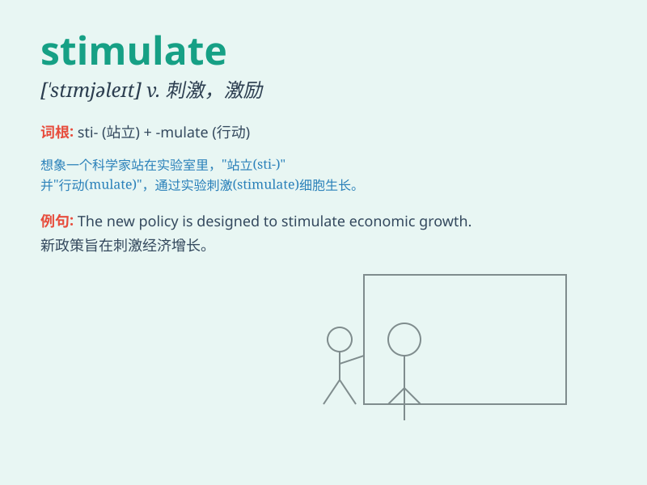

## stimulate

**英音:** _[\'stɪmjʊleɪt]_ **美音:** _[\'stɪmjə\'let]_

**译义:** *vt.刺激,激励v.刺激,激励*

### 短语

+ **stimulate economic growth:** _刺激经济增长_

+ **stimulate interest:** _激发兴趣_

+ **stimulate creativity:** _激发创造力_

+ **stimulate the immune system:** _刺激免疫系统_

+ **stimulate debate:** _激发辩论_

### 例句

#### 例句1

> **The new economic policy is expected to stimulate growth.**

**中文翻译:** 新的经济政策有望刺激增长。

**单词释义:** 刺激；促进

#### 例句2

> **Exercise can stimulate the circulation of blood.**

**中文翻译:** 锻炼可以促进血液循环。

**单词释义:** 促进

#### 例句3

> **The teacher\'s praise stimulated the students to study
harder.**

**中文翻译:** 老师的表扬激励学生们更努力学习。

**单词释义:** 激励

### 背诵小故事

> A scientist discovered a special serum that could stimulate the
growth of plants. When applied, the plants grew faster and stronger.
This serum acted as a powerful stimulant, giving them a boost.

**一位科学家发现了一种特殊的血清，能够刺激植物生长。当使用时，植物生长得更快更强壮。这种血清就像一种强大的刺激物，给了它们助力。**

### 图义

