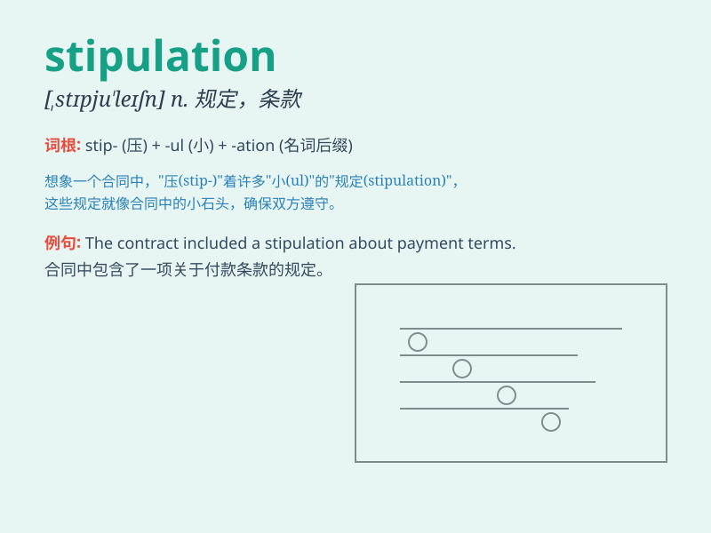

## stipulation

**英音:** _[,stɪpjʊ\'leɪʃn]_ **美音:**
_[,stɪpjə\'leʃən]_

**译义:** *n.约定,约束,契约*

### 短语

+ **contractual stipulation:** _合同规定_

+ **specific stipulation:** _具体规定_

+ **legal stipulation:** _法律规定_

+ **binding stipulation:** _有约束力的规定_

+ **clause stipulation:** _条款规定_

### 例句

#### 例句1

> **The contract contains several stipulations regarding payment and
delivery.**

**中文翻译:** 这份合同包含了几条关于付款和交货的规定。

**单词释义:** 规定；条款

#### 例句2

> **There is a stipulation that all participants must arrive on
time.**

**中文翻译:** 有一项规定是所有参与者必须准时到达。

**单词释义:** 规定；约定

#### 例句3

> **The stipulations of the law are clear on this matter.**

**中文翻译:** 在这件事上，法律的规定很明确。

**单词释义:** 规定；条文

### 背诵小故事

> A king made a stipulation that everyone in the kingdom must plant a
tree. If not, they would be punished. The word \'stipulation\' means a
condition or requirement that is set.

**一位国王制定了一项规定，王国里的每个人都必须种一棵树。否则，他们就会受到惩罚。单词
\'stipulation\' 意思是设定的条件或要求。**

### 图义

