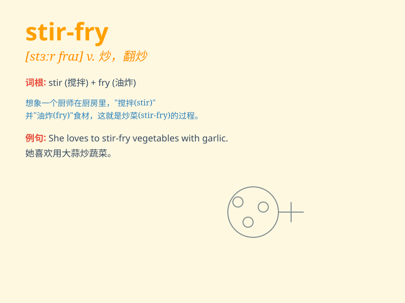

## stir-fry

**英音:** _[ˈstɜː fraɪ]_ **美音:** _[ˈstɜːr fraɪ]_

**译义:** *v.用旺火煸炒，翻炒；n.炒菜*

### 短语

+ **stir-fry vegetables:** _炒蔬菜_

+ **stir-fry chicken:** _炒鸡肉_

+ **stir-fry beef:** _炒牛肉_

+ **stir-fry shrimp:** _炒虾_

+ **stir-fry noodles:** _炒面_

### 例句

#### 例句1

> **I learned how to stir-fry vegetables yesterday.**

**中文翻译:** 我昨天学会了如何炒蔬菜。

**单词释义:** 炒（动词）

#### 例句2

> **The chef is expert at stir-frying meat.**

**中文翻译:** 这位厨师擅长炒肉。

**单词释义:** 炒（动词）

#### 例句3

> **Let\'s stir-fry some noodles for dinner.**

**中文翻译:** 咱们晚餐炒些面条吧。

**单词释义:** 炒（动词）

### 背诵小故事

> One day, Tom was very hungry. His mom decided to stir-fry some
vegetables and meat quickly for him. The delicious smell filled the
kitchen. Tom learned that stir-fry means to cook food by tossing it in a
hot pan.

**有一天，汤姆非常饿。他的妈妈决定快速给他炒一些蔬菜和肉。美味的气味充满了厨房。汤姆了解到
stir-fry 意思是在热锅里翻炒烹饪食物。**

### 图义

