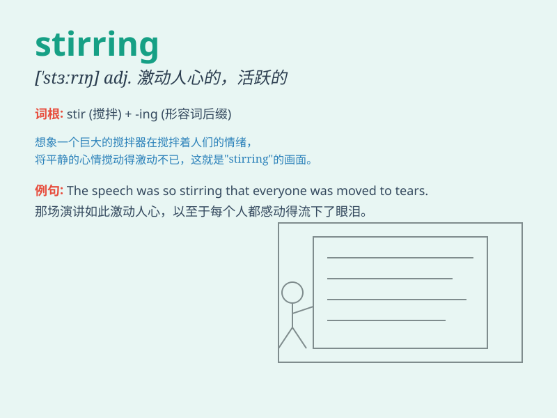

## stirring

**英音:** _[\'stɜːrɪŋ]_ **美音:** _[\'stɝɪŋ]_

**译义:** *adj.激动人心的,活跃的,忙碌的*

### 短语

+ **stirring speech:** _激动人心的演讲_

+ **stirring scene:** _激动人心的场面_

+ **stirring music:** _激动人心的音乐_

+ **stirring event:** _激动人心的事件_

+ **stirring story:** _激动人心的故事_

### 例句

#### 例句1

> **The stirring speech inspired the audience.**

**中文翻译:** 这激动人心的演讲鼓舞了观众。

**单词释义:** 激动人心的

#### 例句2

> **The news caused a stirring of interest.**

**中文翻译:** 这则新闻引起了一阵兴趣。

**单词释义:** 一阵

#### 例句3

> **The stirring music filled the hall.**

**中文翻译:** 激昂的音乐充满了大厅。

**单词释义:** 激昂的

### 背诵小故事

> A brave knight was on a mission. The sound of his horse\'s hooves was
stirring. It made everyone in the village feel excited and hopeful. The
stirring noise was a sign of adventure and change.

**一位勇敢的骑士正在执行任务。他的马蹄声令人激动。这让村里的每个人都感到兴奋和充满希望。这令人激动的声音是冒险和改变的标志。**

### 图义

