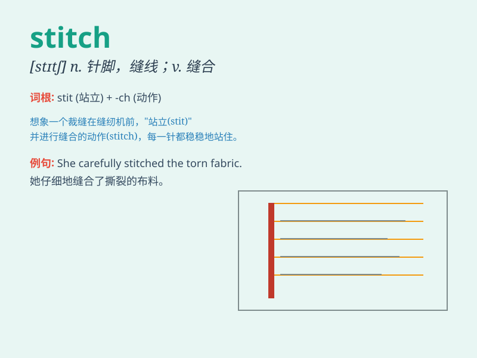

## stitch

**英音:** _[stɪtʃ]_ **美音:** _[stɪtʃ]_

**译义:** *v.缝,缝合n.一针,针脚,缝针*

### 短语

+ **in stitches:** _捧腹大笑；大笑不止_

+ **stitch up:** _缝合；缝补；诬陷；欺骗_

+ **a stitch in time:** _及时处理；防微杜渐_

+ **drop a stitch:** _（编织时）漏织一针_

+ **pick up a stitch:** _（编织时）挑起一针_

### 例句

#### 例句1

> **She had to stitch the hole in her shirt.**

**中文翻译:** 她不得不缝补她衬衫上的洞。

**单词释义:** 缝补；缝合

#### 例句2

> **The doctor will stitch up the wound for you.**

**中文翻译:** 医生会为你缝合伤口。

**单词释义:** 缝合

#### 例句3

> **He managed to stitch a deal with the supplier.**

**中文翻译:** 他设法与供应商达成了一笔交易。

**单词释义:** 达成（协议）；做成（交易）

### 背诵小故事

> A tailor was working hard to stitch a beautiful dress. Every stitch
was precise and full of care. He focused on joining the pieces together
perfectly. Finally, the dress was ready, thanks to all those wonderful
stitches.

**一位裁缝正在努力缝制一件漂亮的连衣裙。每一针都很精准且充满用心。他专注地将各片布料完美地缝合在一起。最终，因为这些出色的针脚，裙子做好了。**

### 图义

