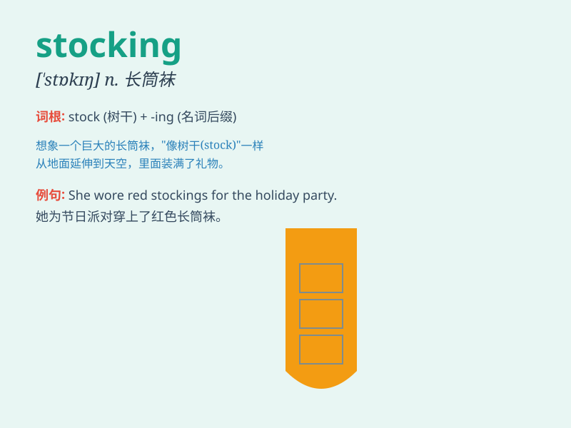

## stocking

**英音:** _[\'stɒkɪŋ]_ **美音:** _[\'stɑkɪŋ]_

**译义:** *n.长袜*

### 短语

+ **Christmas stocking:** _圣诞袜_

+ **fishnet stocking:** _网眼袜_

+ **silk stocking:** _丝袜_

+ **stocking cap:** _绒线帽_

+ **stocking stuffer:** _（圣诞节放在袜子里的）小礼物_

### 例句

#### 例句1

> **She wore red stockings to the party.**

**中文翻译:** 她穿着红色的长袜去参加聚会。

**单词释义:** 长袜

#### 例句2

> **The Christmas stocking was filled with small gifts.**

**中文翻译:** 圣诞袜里装满了小礼物。

**单词释义:** 长袜；（尤指圣诞时挂起来装礼物的）袜子

#### 例句3

> **He bought a pair of silk stockings for his wife.**

**中文翻译:** 他给他妻子买了一双丝袜。

**单词释义:** 长袜

### 背诵小故事

> On Christmas Eve, Santa Claus filled the stockings hanging by the
fireplace with gifts. The children woke up excitedly to find their
stockings stuffed with toys and candies. Stocking here means a long sock
for decoration or gift storage.

**在平安夜，圣诞老人把挂在壁炉旁的长袜装满了礼物。孩子们兴奋地醒来，发现他们的长袜里装满了玩具和糖果。这里的stocking指的是用于装饰或存放礼物的长袜。**

### 图义

