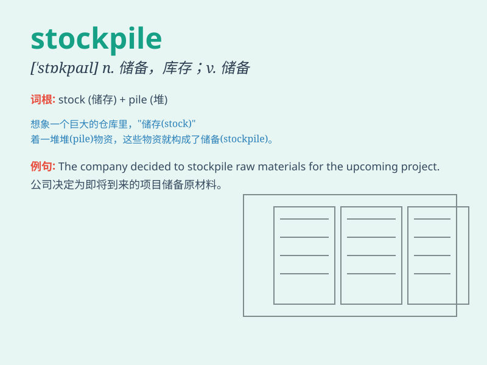

## stockpile

**英音:** _[\'stɒkpaɪl]_ **美音:** _[\'stɑkpaɪl]_

**译义:** *n.积蓄,库存vt.储蓄,贮存*

### 短语

+ **stockpile weapons:** _储备武器_

+ **stockpile food:** _储存食物_

+ **stockpile resources:** _储备资源_

+ **build a stockpile:** _建立储备_

+ **increase the stockpile:** _增加储备_

### 例句

#### 例句1

> **The government is stockpiling medical supplies in case of a
pandemic.**

**中文翻译:** 政府正在储备医疗物资以防大流行病。

**单词释义:** 储备

#### 例句2

> **The company has a large stockpile of raw materials.**

**中文翻译:** 这家公司有大量的原材料库存。

**单词释义:** 库存

#### 例句3

> **They decided to stockpile food and water before the storm.**

**中文翻译:** 他们决定在风暴来临前储备食物和水。

**单词释义:** 储备

### 背诵小故事

> A king ordered his soldiers to stockpile a large amount of food and
weapons in a secret cave. They worked hard to collect and store
everything for possible wars. \'Stockpile\' means to accumulate and
store a large supply of something.

**一位国王命令他的士兵在一个秘密洞穴中大量储备食物和武器。他们努力收集和存储一切，以防可能发生的战争。\'stockpile\'意思是大量积累和储存某物。**

### 图义

