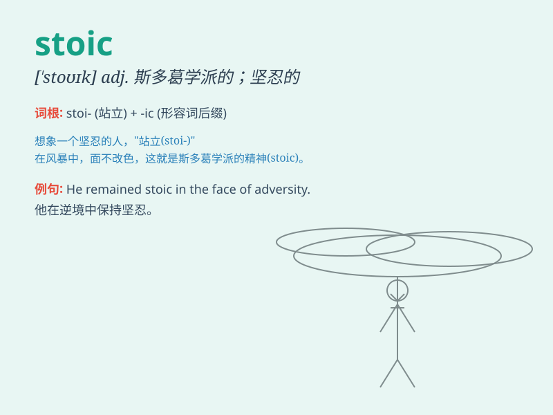

## stoic

**英音:** _[ˈstəʊɪk]_ **美音:** _[ˈstoʊɪk]_

**译义:** *n. 高度自制者,坚忍克己之人 Stoic 斯多葛学派哲学家*

### 短语

+ **stoic calm:** _坚忍的平静_

+ **stoic acceptance:** _坦然接受_

+ **stoic resignation:** _坚忍的顺从_

+ **stoic endurance:** _坚忍的忍耐_

+ **stoic philosophy:** _斯多葛哲学_

### 例句

#### 例句1

> **The stoic philosopher remained calm in the face of adversity.**

**中文翻译:** 这位坚忍的哲学家在逆境面前保持冷静。

**单词释义:** 坚忍的；禁欲主义的

#### 例句2

> **Despite the pain, she adopted a stoic attitude.**

**中文翻译:** 尽管疼痛，她还是采取了坚忍的态度。

**单词释义:** 坚忍的；克制感情的

#### 例句3

> **He is a stoic man who never complains about his hardships.**

**中文翻译:** 他是个从不抱怨艰难困苦的坚忍之人。

**单词释义:** 坚忍的；坦然面对困难的

### 背诵小故事

>
有一个人在面对生活中的各种困难时，总是表现得非常冷静和淡定，就像一尊石像一样不为所动。大家都觉得他是个stoic的人。后来人们就用这个词形容那些在困境中能沉着冷静的人。

**有一个人面对困难冷静淡定，像石像般不为所动，大家称其为 stoic
的人，此词形容困境中沉着冷静之人。**

### 图义

