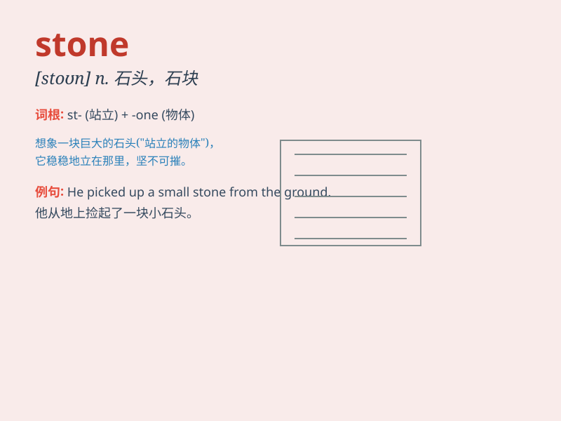

## stone

**英音:** _[stəʊn]_ **美音:** _[ston]_

**译义:** *n.石,石头,宝石*

### 短语

+ **stone wall:** _石墙_

+ **rolling stone:** _滚石；居无定所的人_

+ **stone bridge:** _石桥_

+ **precious stone:** _宝石_

+ **stone fruit:** _核果_

### 例句

#### 例句1

> **The house is built of stone.**

**中文翻译:** 这座房子是用石头建造的。

**单词释义:** 石头

#### 例句2

> **She threw a stone into the lake.**

**中文翻译:** 她把一块石头扔进了湖里。

**单词释义:** 石头

#### 例句3

> **The doctor removed the stone from his kidney.**

**中文翻译:** 医生从他的肾脏里取出了结石。

**单词释义:** 结石

### 背诵小故事

> A poor man was walking on the road and suddenly found a shiny stone.
He thought it was a precious gem and his life would change. But in the
end, it was just an ordinary stone. However, he still kept it as a
souvenir.

**一个穷人在路上走着，突然发现了一块闪闪发光的石头。他以为是珍贵的宝石，自己的生活会改变。但最后，这只是一块普通的石头。不过，他还是把它留作纪念。**

### 图义

