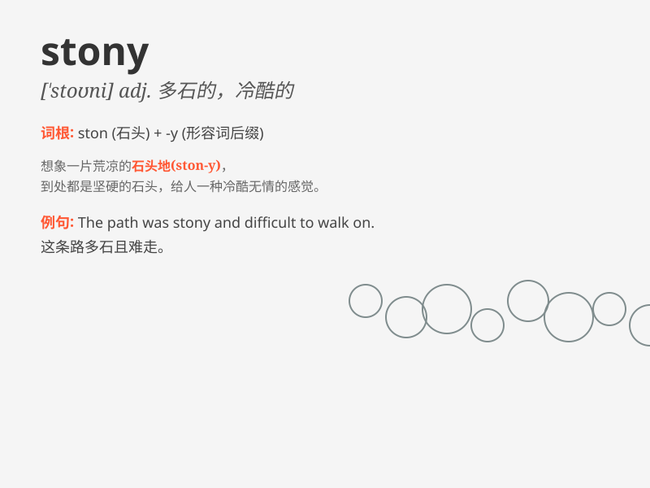

## stony

**英音:** _[\'stəʊnɪ]_ **美音:** _[\'stoni]_

**译义:** *adj.多石的,无情的*

### 短语

+ **stony heart:** _铁石心肠_

+ **stony silence:** _冷冰冰的沉默_

+ **stony soil:** _多石的土壤_

+ **stony path:** _石头铺的小路_

+ **stony face:** _冷漠的脸_

### 例句

#### 例句1

> **The stony path was difficult to walk on.**

**中文翻译:** 这条石头铺的路很难走。

**单词释义:** 多石的；石头的

#### 例句2

> **He gave me a stony look when I asked for help.**

**中文翻译:** 当我请求帮助时，他冷冷地看了我一眼。

**单词释义:** 冷漠的；无情的

#### 例句3

> **The fields beyond the village were stony and barren.**

**中文翻译:** 村子外面的田地多石且贫瘠。

**单词释义:** 多石头的；荒芜的

### 背诵小故事

> A traveler was lost in a stony desert. The ground was full of hard
stones, making his walk very difficult. He felt so tired but still had
to keep going. Remember, \'stony\' means full of stones.

**一位旅行者在多石的沙漠中迷路了。地面布满了坚硬的石头，让他举步维艰。他感到非常疲惫但仍得继续前行。记住，'stony'意思是多石的。**

### 图义

