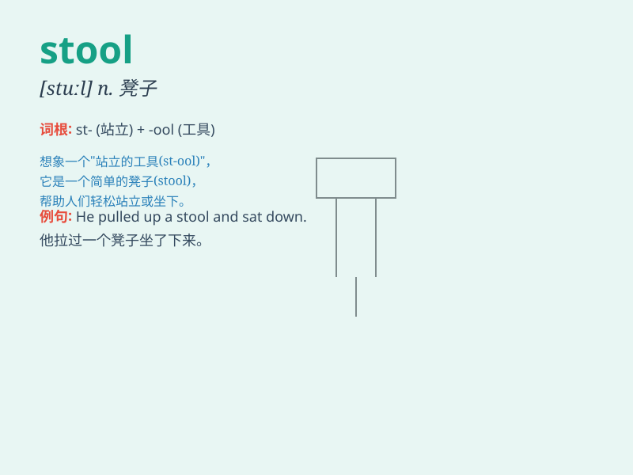

## stool

**英音:** _[stuːl]_ **美音:** _[stʊl]_

**译义:** *n.凳子,大便,厕所vi.长新枝vt.诱捕*

### 短语

+ **bar stool:** _酒吧高脚凳_

+ **foot stool:** _脚凳_

+ **stool sample:** _粪便样本_

+ **wooden stool:** _木凳_

+ **three-legged stool:** _三条腿的凳子_

### 例句

#### 例句1

> **He sat on the stool and waited.**

**中文翻译:** 他坐在凳子上等待。

**单词释义:** 凳子

#### 例句2

> **The doctor asked her to provide a stool sample.**

**中文翻译:** 医生要求她提供一份粪便样本。

**单词释义:** 粪便

#### 例句3

> **The bird hopped onto the stool and chirped.**

**中文翻译:** 那只鸟跳上凳子并叽叽喳喳叫。

**单词释义:** 凳子

### 背诵小故事

> One day, a little monkey was playing in the forest. It found a
strange stool and sat on it. But the stool was not stable and the monkey
fell down. It learned that not all stools are reliable.

**一天，一只小猴子在森林里玩耍。它发现了一个奇怪的凳子然后坐了上去。但是凳子不稳，猴子摔了下来。它明白了不是所有的凳子都可靠。**

### 图义

