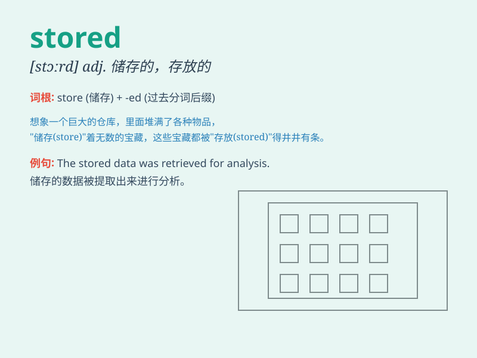

## stored

**英音:** _[stɔːd]_ **美音:** _[stɔːrd]_

**译义:** *v. 存储；储藏；保存（store 的过去式和过去分词）*

### 短语

+ **stored procedure:** _存储过程_

+ **stored energy:** _储存能量_

+ **stored data:** _存储数据_

+ **stored goods:** _库存货物_

+ **stored program:** _存储程序_

### 例句

#### 例句1

> **The data is stored in the cloud.**

**中文翻译:** 数据被存储在云端。

**单词释义:** 存储

#### 例句2

> **Food should be stored at the correct temperature.**

**中文翻译:** 食物应该在正确的温度下储存。

**单词释义:** 储存

#### 例句3

> **The memories are stored deep in her heart.**

**中文翻译:** 那些记忆深深地存储在她的心里。

**单词释义:** 存储

### 背诵小故事

> One day, Tom went to a big warehouse. He saw a lot of goods neatly
stored on the shelves. The word \'stored\' means placed and kept in a
particular place for future use or reference.

**一天，汤姆去了一个大仓库。他看到很多货物整齐地存放在架子上。单词"stored"意思是放置并保存在特定的地方以备将来使用或参考。**

### 图义

