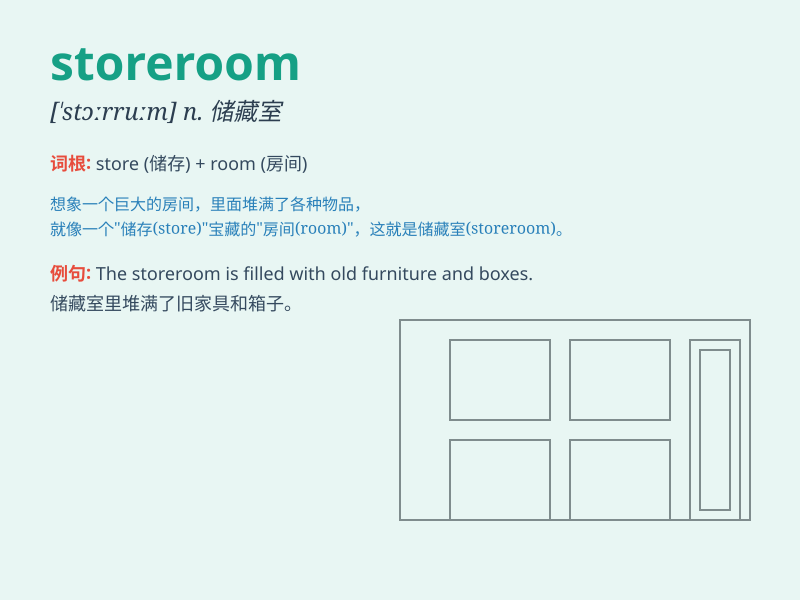

## storeroom

**英音:** _[\'stɔːruːm; -rʊm]_ **美音:** _[\'stɔrum]_

**译义:** *n.储藏室,库房*

### 短语

+ **storeroom keeper:** _仓库管理员_

+ **storeroom inventory:** _仓库库存_

+ **storeroom access:** _仓库准入_

+ **storeroom organization:** _仓库组织_

+ **storeroom security:** _仓库安全_

### 例句

#### 例句1

> **The storeroom is filled with various supplies.**

**中文翻译:** 这个储藏室里装满了各种各样的物资。

**单词释义:** 储藏室

#### 例句2

> **I found the missing tool in the storeroom.**

**中文翻译:** 我在储藏室里找到了丢失的工具。

**单词释义:** 储藏室

#### 例句3

> **They are cleaning out the storeroom to make more space.**

**中文翻译:** 他们正在清理储藏室以腾出更多空间。

**单词释义:** 储藏室

### 背诵小故事

> Once upon a time, a little mouse was looking for food and found a
hidden storeroom. It was full of grains and treats. The mouse was so
happy and shared the news with its friends.

**从前，一只小老鼠正在找食物，发现了一个隐藏的储藏室。里面装满了谷物和美食。老鼠非常高兴，并把这个消息分享给了它的朋友们。**

### 图义

