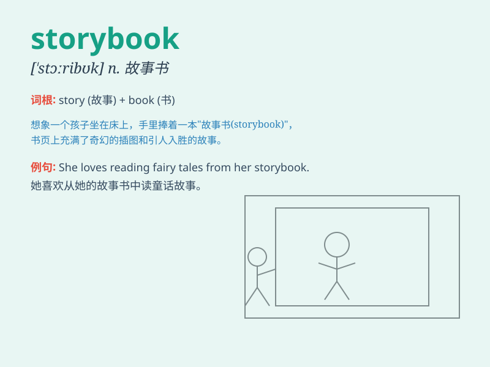

## storybook

**英音:** _[\'stɔːrɪbʊk]_ **美音:** _[\'stɔrɪ\'bʊk]_

**译义:** *n. 故事书,小说adj. 像童话故事那样圆满幸福的*

### 短语

+ **read a storybook:** _读一本故事书_

+ **write a storybook:** _写一本故事书_

+ **illustrated storybook:** _有插图的故事书_

+ **children\'s storybook:** _儿童故事书_

+ **fairy tale storybook:** _童话故事书_

### 例句

#### 例句1

> **The child was immersed in the storybook and forgot about the
time.**

**中文翻译:** 这个孩子沉浸在故事书里，忘记了时间。

**单词释义:** 故事书

#### 例句2

> **She received a beautiful storybook as a birthday present.**

**中文翻译:** 她收到了一本漂亮的故事书作为生日礼物。

**单词释义:** 故事书

#### 例句3

> **The library has a large collection of storybooks for
children.**

**中文翻译:** 图书馆有大量的儿童故事书收藏。

**单词释义:** 故事书

### 背诵小故事

> One day, a little girl found a magic storybook. Every time she opened
it, wonderful stories appeared. The book was like a portal to different
worlds. She loved it and read it every night.

**有一天，一个小女孩发现了一本神奇的故事书。每次她打开它，精彩的故事就会出现。这本书就像通往不同世界的入口。她非常喜欢，每晚都读。**

### 图义

