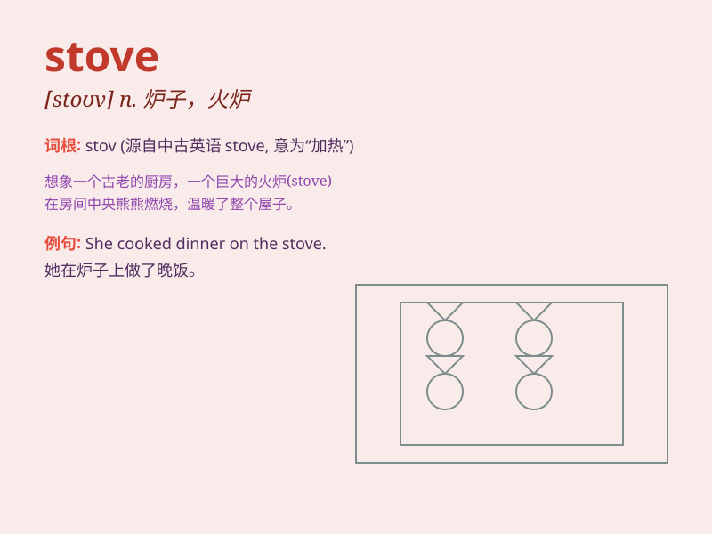

## stove

**英音:** _[stəʊv]_ **美音:** _[stov]_

**译义:** *n.炉*

### 短语

+ **gas stove:** _煤气炉_

+ **wood stove:** _木柴炉_

+ **electric stove:** _电炉_

+ **cooking stove:** _厨灶；炉灶_

+ **portable stove:** _便携式炉灶_

### 例句

#### 例句1

> **The stove in the kitchen is broken.**

**中文翻译:** 厨房里的炉灶坏了。

**单词释义:** 炉灶

#### 例句2

> **She put the pot on the stove to boil water.**

**中文翻译:** 她把锅放在炉灶上烧水。

**单词释义:** 炉灶

#### 例句3

> **The old man sat beside the stove to warm himself.**

**中文翻译:** 老人坐在炉灶旁边取暖。

**单词释义:** 炉灶

### 背诵小故事

> One cold winter day, I was shivering. Then I found a warm stove in an
old house. The fire inside the stove was burning brightly, making me
feel cozy. With the stove\'s heat, I forgot the cold outside.

**在一个寒冷的冬日，我冻得发抖。然后我在一间老房子里发现了一个温暖的火炉。火炉里面的火燃烧得很旺，让我感到舒适。有了火炉的热量，我忘记了外面的寒冷。**

### 图义

