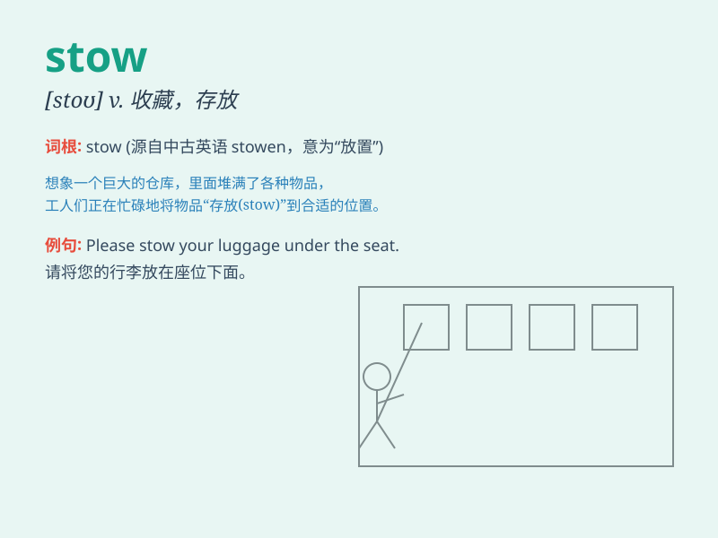

## stow

**英音:** _[stəʊ]_ **美音:** _[sto]_

**译义:** *v.装载*

### 短语

+ **stow away:** _（未经允许）偷乘；偷渡_

+ **stow something in/into:** _把某物收藏在...；把某物装在..._

+ **stow something away:** _妥善收藏某物；把某物存放好_

+ **stow neatly:** _整齐地存放_

+ **stow securely:** _安全地存放_

### 例句

#### 例句1

> **He helped stow the luggage in the trunk of the car.**

**中文翻译:** 他帮忙把行李存放在汽车后备箱里。

**单词释义:** 存放；贮藏

#### 例句2

> **The sailors were busy stowing the cargo on the ship.**

**中文翻译:** 水手们正忙着把货物装到船上。

**单词释义:** 装货；装载

#### 例句3

> **She carefully stowed her jewelry away in the safe.**

**中文翻译:** 她小心地把珠宝存放在保险箱里。

**单词释义:** 妥善放置；收好

### 背诵小故事

> 想象一下，在一艘大船上，水手们把各种货物整齐地
STOW（存放）在船舱里。他们小心翼翼，确保每一件物品都被妥善安置，以保证航行的安全和顺利。

**想象水手在船上妥善存放货物来记住 stow 表示存放的意思**

### 图义

