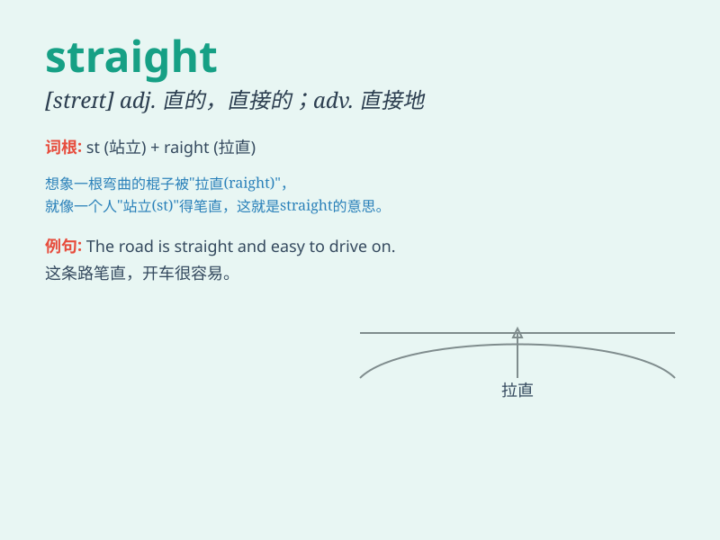

## straight

**英音:** _[streɪt]_ **美音:** _[stret]_

**译义:** *adj.直的,诚实的,正直的,率直的,整齐的adv.直,直接,一直*

### 短语

+ **straight away:** _立即；马上_

+ **straight face:** _绷着脸；不露笑容_

+ **straight line:** _直线_

+ **straight forward:** _简单明了的；坦率的_

+ **straight out:** _直言地；坦率地_

### 例句

#### 例句1

> **Go straight ahead and you\'ll see the library on your right.**

**中文翻译:** 一直往前走，你会看到图书馆在你的右边。

**单词释义:** 笔直地（副词）

#### 例句2

> **She has straight black hair.**

**中文翻译:** 她有一头笔直的黑发。

**单词释义:** 笔直的（形容词）

#### 例句3

> **Tell me the straight truth.**

**中文翻译:** 告诉我直截了当的真相。

**单词释义:** 直截了当的（形容词）

### 背诵小故事

> A little boy was lost in a maze. He kept walking straight ahead, not
turning left or right. Finally, he found the exit. Remember,
\'straight\' means going in a direct line.

**一个小男孩在迷宫里迷路了。他一直笔直向前走，不向左也不向右拐。最后，他找到了出口。记住，'straight'意思是笔直的，直的。**

### 图义

