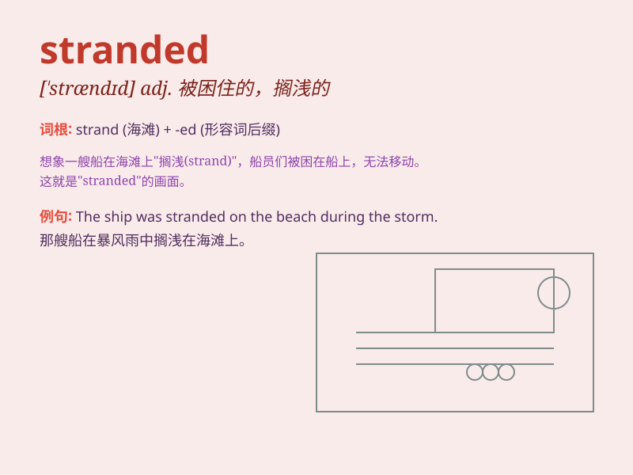

## stranded

**英音:** _[ˈstrændɪd]_ **美音:** _[ˈstrændɪd]_

**译义:** *adj. 搁浅的；被困的；滞留的；被抛弃的；v.
使...搁浅；使...陷入困境；使...停滞（strand 的过去式及过去分词形式）*

### 短语

+ **be stranded:** _被困；处于困境_

+ **stranded passengers:** _滞留的乘客_

+ **stranded vessel:** _搁浅的船只_

+ **stranded assets:** _搁浅资产；闲置资产_

+ **stranded on an island:** _被困在一个岛上_

### 例句

#### 例句1

> **The stranded tourists were finally rescued by the local
authorities.**

**中文翻译:** 被困的游客最终被当地政府营救了。

**单词释义:** 被困的

#### 例句2

> **The ship was stranded on the rocks during the storm.**

**中文翻译:** 在暴风雨中，这艘船搁浅在岩石上。

**单词释义:** 搁浅的

#### 例句3

> **He felt stranded and helpless in a foreign country without
money.**

**中文翻译:** 他在异国他乡身无分文，感到孤立无援。

**单词释义:** 孤立无援的

### 背诵小故事

> A group of travelers were on a boat. Suddenly, a storm hit and the
boat broke. They were left stranded on a deserted island, waiting for
rescue. Poor them!

**一群旅行者在船上。突然，一场风暴袭来，船坏了。他们被困在一个荒岛上，等待救援。真可怜！**

### 图义

