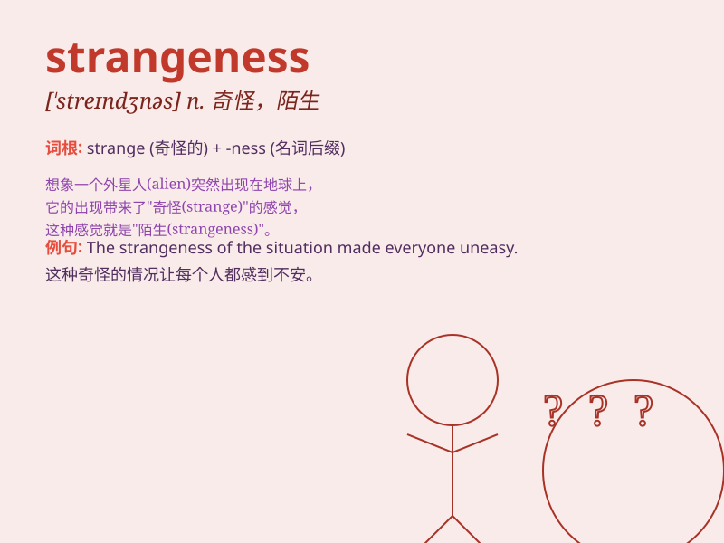

## strangeness

**英音:** _[\'streɪn(d)ʒnɪs]_ **美音:** _[\'strendʒnɪs]_

**译义:** *n.陌生,奇妙,不可思议*

### 短语

+ **sense of strangeness:** _陌生感_

+ **strangeness factor:** _奇异因子_

+ **degree of strangeness:** _陌生程度_

+ **experience strangeness:** _体验陌生_

+ **overcome strangeness:** _克服陌生_

### 例句

#### 例句1

> **The strangeness of the new place made her feel a little
uneasy.**

**中文翻译:** 新地方的陌生感让她感到有点不安。

**单词释义:** 陌生；奇怪

#### 例句2

> **He was attracted by the strangeness of the ancient artifact.**

**中文翻译:** 他被那件古代文物的奇特之处所吸引。

**单词释义:** 奇特；奇异

#### 例句3

> **The strangeness of his behavior raised suspicion among his
colleagues.**

**中文翻译:** 他行为的怪异在同事中引起了怀疑。

**单词释义:** 怪异；奇怪

### 背诵小故事

> One day, a traveler entered a strange town. Everything was unfamiliar
-- the houses, the people, and the customs. The traveler felt the
strangeness deeply. But he decided to explore and learn about this
unique place.

**有一天，一位旅行者进入了一个陌生的城镇。一切都很陌生------房屋、人们和风俗。旅行者深深地感受到了这种陌生。但他决定去探索并了解这个独特的地方。**

### 图义

