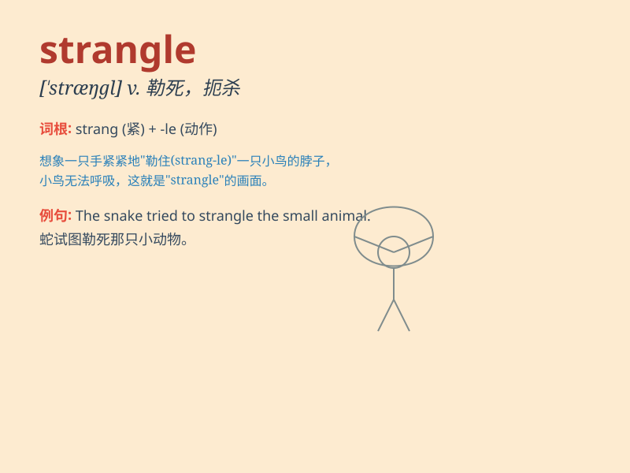

## strangle

**英音:** _[\'stræŋg(ə)l]_ **美音:** _[\'stræŋɡl]_

**译义:** *v.扼死*

### 短语

+ **strangle hold:** _束缚；箝制；压制_

+ **strangle someone to death:** _把某人勒死_

+ **strangle a protest:** _压制抗议_

+ **strangle the economy:** _使经济窒息_

+ **strangle a plan:** _扼杀计划_

### 例句

#### 例句1

> **The criminal tried to strangle the victim.**

**中文翻译:** 那个罪犯试图勒死受害者。

**单词释义:** 勒死；扼死；使窒息

#### 例句2

> **The snake might strangle its prey.**

**中文翻译:** 这条蛇可能会勒死它的猎物。

**单词释义:** 勒紧；绞死

#### 例句3

> **Fear almost strangled her voice.**

**中文翻译:** 恐惧几乎使她声音哽塞。

**单词释义:** 抑制；使说不出话

### 背诵小故事

> A thief was trying to escape, but the brave policeman caught him and
used a rope to strangle his movement. Finally, the thief was arrested.

**一个小偷试图逃跑，但勇敢的警察抓住了他并用绳子勒住他的行动。最终，小偷被逮捕了。**

### 图义

